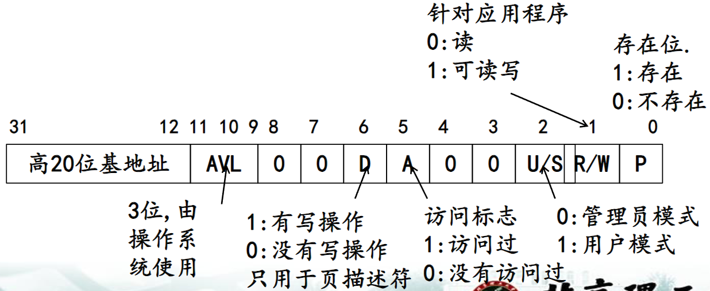
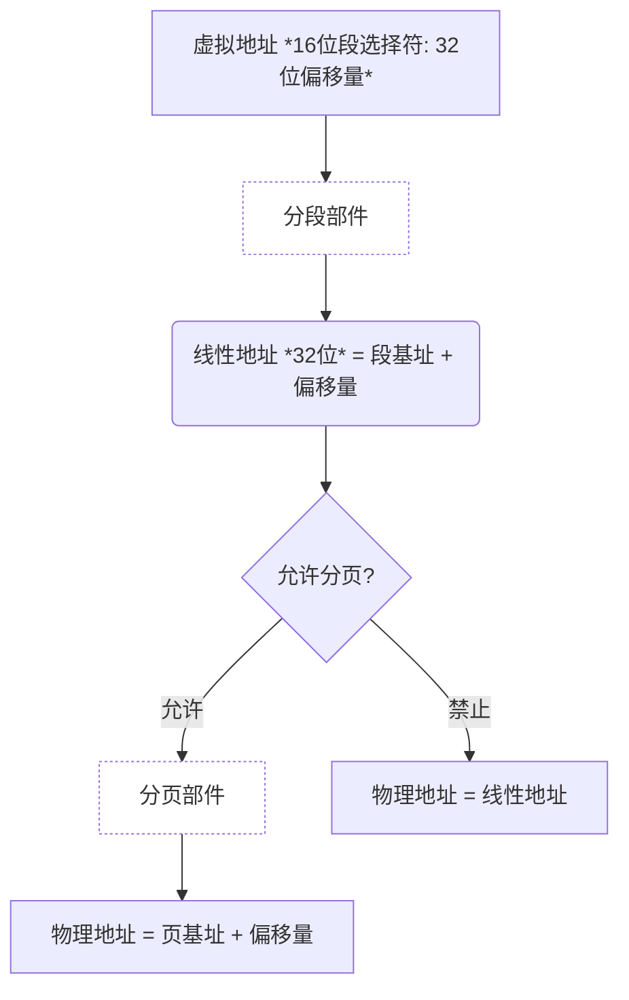
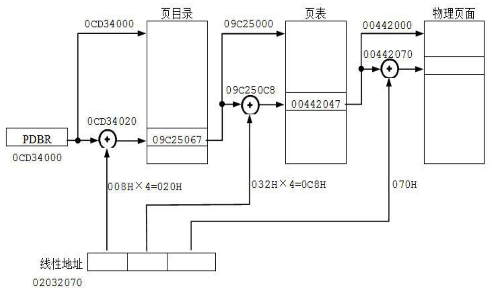

## 内存管理

- **实模式**：分段管理，存储器寻址，20位物理地址的计算，段地址*10H+offset。
- **保护模式**：段描述符（段地址32；限长20；DPL:描述符特权级；页式存储；每页4K）
- 虚拟地址到物理地址转换，16bit段选择符+32位offset；页式转换；
- PDBR:页目录基址寄存器；分页机制(10bit页目录索引+10位页表索引+12bit页面索引)

### 实模式分段管理

- 对段基址的限定
  - 只要工作在实模式，段基址必须定位在地址为16的整数倍上，这种段起始边界通常称做节或小段。
- 对段长的限定
  - 在实模式下段长不能超过64K (16位)

> 段基址占16位（因为段寄存器只有保存16位） 偏移量也是16位 获得物理地址的方法是先将段基址右移四位（x16）再加上偏移量，刚好是二十位，即为实模式下的二十位物理地址寻址方式（1MB寻址空间）。

程序执行时，其当前段的段基址放在相应的段寄存器中，偏移量视访问内存的操作类型决定，其规律如下页表所示。（段基址和偏移量一块用的规律）

| 操作类型 | 约定段寄存器 | 允许指定的段寄存器 | 偏移量 | 
| :------: | :------: | :------: | :------: |
| 1. 指令  | CS | 无 | IP | 
| 2. 堆栈操作  | SS | 无 | SP | 
| 3. 普通变量  | DS | ES,SS,CS | EA |
| 4. 字符串指令的源串地址 | DS | ES,SS,CS | SI | 
| 5. 字符串指令的目标串地址 | ES | 无 | DI | 
| 6. BP用作基址寄存器  | SS | DS,ES,CS | EA |

> 串指令的目的操作数一定是由ES:DI指定的，源操作数一定是由DS:SI指定的，这是串指令的特点。

```markdown
19．串指令中的目的操作数地址是由______提供。
A．SS:[BP]
B．DS:[SI]
C．ES:[DI]
D．CS:[IP]

参考答案为:C
```

<details>
<summary>
某内存单元的地址用十六进制数表示为1234:5678，则其物理地址为
</summary>
解答：
12340H＋5678H＝179B8H
</details>

### 保护模式下的分段管理

在保护模式下，其内存管理既可以使用**分段机制**访问多达4 GB（386/486）或64 GB（Pentium）的内存空间，也可以使用**分页机制**访问多达16 TB的虚拟存储器。总之，保护模式打破了实模式只允许访问装在内存第一个1MB之内的程序和数据的限制。

> 可以看一下[地址变换](./地址变换.md)的内容来理解一下这段话
>
> 无非就是以下理解：
> - 实模式： 16 + 4 = 20 --> 1MB
> - 保护模式：
>   - 分段机制：16 + 16 = 32 --> 4 GB
>   - 分页机制（这里其实是段页式存储）：16 + 16 + 12 = 44 --> 16 TB才对 （每页4KB就是12）

#### 段描述符

<div>
<table>
    <tr>
        <td>+0</td>
        <td colspan="8" align=center>限长 (位7~0)</td>
    </tr>
    <tr>
        <td>+1</td>
        <td colspan="8" align=center>限长 (位15~8)</td>
    </tr>
    <tr>
        <td>+2</td>
        <td colspan="8" align=center>段基址 (位7~0)</td>
    </tr>
    <tr>
        <td>+3</td>
        <td colspan="8" align=center>段基址 (位15~8)</td>
    </tr>
    <tr>
        <td>+4</td>
        <td colspan="8" align=center>段基址 (位23~16)</td>
    </tr>
    <tr>
        <td>+5</td>
        <td colspan="1" align=center> P </td>
        <td colspan="2" align=center> DPL </td>
        <td colspan="1" align=center> S </td>
        <td colspan="4" align=center> TYPE </td>
    </tr>
    <tr>
        <td>+6</td>
        <td colspan="1" align=center> G </td>
        <td colspan="1" align=center> D/B </td>
        <td colspan="1" align=center> 0 </td>
        <td colspan="1" align=center> AVL </td>
        <td colspan="4" align=center> 限长 (位19~16)</td>
    </tr>
    <tr>
        <td>+7</td>
        <td colspan="8" align=center>段基址 (位31~24)</td>
    </tr>
</table>
</div>

其中对于第五个字节

| 机器符号 | 作用 |
| :-----: | :--: |
| P | 存在位 1：装入内存 0：不在内存|
| DPL | 特权位 00,01,10,11,保护模式弄的|
| S | S=1是非系统段：数据段或者代码段；S=0是系统段描述符 |

其中对于TPYE我们可以确定段的信息

当E为0时表示该段属于数据段或者堆栈段，此时type为

<table>
    <tr>
        <td colspan="1" align=center>
            3
        </td>
        <td colspan="1" align=center>
            2
        </td>
        <td colspan="1" align=center>
            1
        </td>
        <td colspan="1" align=center>
            0
        </td>
    </tr>
    <tr>
        <td colspan="1" align=center>
            E = 0
        </td>
        <td colspan="1" align=center>
            ED (扩展方向位：1：向下扩展 0：向上扩展)
        </td>
        <td colspan="1" align=center>
            W (可写位)
        </td>
        <td colspan="1" align=center>
            A
        </td>
    </tr>
</table>

当E为1时表示该段属于代码段，此时type为

<table>
    <tr>
        <td colspan="1" align=center>
            3
        </td>
        <td colspan="1" align=center>
            2
        </td>
        <td colspan="1" align=center>
            1
        </td>
        <td colspan="1" align=center>
            0
        </td>
    </tr>
    <tr>
        <td colspan="1" align=center>
            E = 1
        </td>
        <td colspan="1" align=center>
            C (一致位: 0：非一致 1：一致)
        </td>
        <td colspan="1" align=center>
            R (可读位)
        </td>
        <td colspan="1" align=center>
            A
        </td>
    </tr>
</table>

对于第六个字节的高四位属性

<table>
    <tr>
        <td colspan="1" align=center> G </td>
        <td colspan="1" align=center> D/B </td>
        <td colspan="1" align=center> 0 </td>
        <td colspan="1" align=center> AVL </td>
    </tr>
</table>

| 机器符号 | 作用 |
| :-----: | :--: |
| G | 粒度位 ，=1以页为单位，=0以字节为单位|
| D/B | D/B位，系统段不用这位|
| AVL | S=1是非系统段：数据段或者代码段；S=0是系统段描述符 |

对于非系统段

<table>
  <tr>
    <td rowspan="4">D/B位</td>
    <td rowspan="2">代码段(D位)</td>
    <td>D=1 使用32位操作系统和32位寻址方式</td>
  </tr>
  <tr>
    <td>D=0 使用16位操作系统和16位寻址方式</td>
  </tr>
  <tr>
    <td rowspan="2">数据段(B位)</td>
    <td>B=1 堆栈使用ESP寄存器，上限为FFFFFFFFH</td>
  </tr>
  <tr>
    <td>B=0 堆栈使用SP寄存器，上限为FFFFH</td>
  </tr>
</table>

#### 页式内存管理

- 保护模式下的CPU支持分页机制，并且**分页管理是在分段管理机制的基础上**工作，它将分段管理机制得到的线性地址转换为物理地址。
- 使用分页机制的好处在于，它可以把每个活动任务当前所必需的**少量页面**放在内存中，而不必将整个段调入内存，从而提高了内存的使用效率

<table>
    <tr>
        <td colspan="10" align=center>31~22</td>
        <td colspan="10" align=center>21~12</td>
        <td colspan="12" align=center>11~0</td>
    </tr>
    <tr>
        <td colspan="10" align=center>0000 0000 00</td>
        <td colspan="10" align=center>00 0000 0000</td>
        <td colspan="12" align=center>0000 0000 0000</td>
    </tr>
    <tr>
        <td colspan="10" align=center>页目录索引</td>
        <td colspan="10" align=center>页表索引</td>
        <td colspan="12" align=center>字节索引</td>
    </tr>
</table>

其中第1项是对页目录（Page Directory）的索引，第2项是对页表（Page Tables）的索引，第3项是线性地址在页面内的偏移。

> PDBR:页目录基址寄存器存放页目录表的基址

页目录中存放页表描述符，页表中存放页描述符，二者都叫做页表项，都是32位。

<details>
<summary>页表项格式</summary>



- 页表描述符提供了页面保护位
- 页目录、页表和物理页的基地址的低12位全部为0，定位在页的边界上。
- 页表项的低12位提供保护功能和统计信息。U/S位、R/W位、P位实现页保护机制，p32。
- 一个物理页存在两级保护,页表描述符和页描述符属性。当二者不一致的时候取严格属性。
- 每次内存操作都需要将线性地址转换为物理地址，转换过程中需要访问页目录表和页表来取得页表描述符和页描述符。为了提高转换效率，CPU内部设置了片内转换检测缓冲器**TLB（Translation Lookaside Buffer）**，其中保存了32个页描述符，它们都是最近使用过的

</details>

### 地址变换

运行分页在LDT上，实现DS:[EBX]虚拟地址生成物理地址，参照下图。

<table>
<tr>
<td colspan="1" align=center>
<details>
<summary>
虚拟地址生成物理地址总流程
</summary>



</details>
</td>
<td colspan="1" align=center>
<details>
<summary>线性地址生成物理地址</summary>


</details>
</td>
</tr>    
</table>


1. 首先根据DS中的索引找到LDT中的段描述符
2. 根据段描述符中的基地址和[EBX]偏移地址生成线性地址
3. 根据线性地址中的页目录索引在页目录中找到页表描述符
   - 根据页表描述符中的页表基地址和线性地址中的页表索引找到页描述符
   - 根据页描述符中的基地址和线性地址中的页内偏移生成物理地址