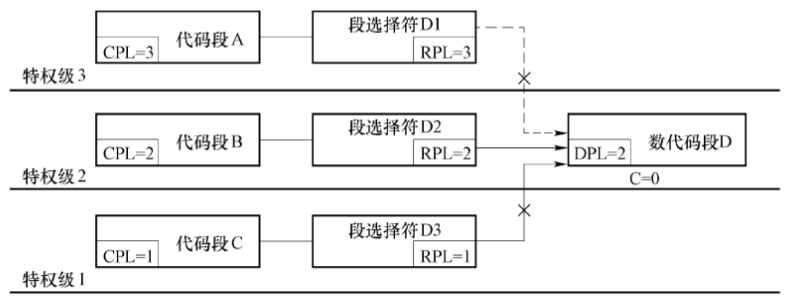

## 保护

> 只能访问较低特权级的数据段（高特权级数据优先不能访问），只能跳转或调用较高特权级的代码段（高特权级代码优先执行的意思）

### **数据访问的保护**


1. 类型检查
2. 限长、类型和属性检查
3. 特权级检查
   1. DPL ≥ MAX(CPL, RPL)，
   2. 即程序只能访问特权级相同或者较低的数据

### **对程序的保护**


| C = 0 代码段 | C = 1 代码段 |
| :----------: | :----------: |
|   |     |

1. 直接转移的保护
   1. 同一代码段跳转只检查限长
   2. 段间调用或跳转，需要检查限长，特权级CPL和DPL
      1. CPL=DPL，允许跳转和调用
      2. CPL<DPL，禁止
      3. CPL>DPL，此时要检查段描述符的C位。如果C位为1，表示这是一致代码段,允许跳转和调用
   3. 当不是一致代码段时 C=0
      1. 只有CPL=DPL才允许跳转和调用
      2. 还要求RPL ≤ CPL
   4. 如果是一致代码段时 C=1
      1. CPL=DPL和CPL>DPL都允许跳转和调用
         1. 表示**DPL的代码段可以由特权级相同或更低的程序来调用或跳转**
         2. 转移后特权级CPL不变
      2. CPL < DPL不可以调用
         1. 表示**特权级较高的CPL的代码段不可以调用DPL的代码段**
2. 间接转移的保护 *好复杂*
   1. 检查jmp和call程序的特权级
   2. call
      1. $DPL_{GATE} \ge \max(CPL, RPL)$
      2. $DPL_{CODE} \le CPL$
      3. 满足上面两个条件执行调用门
      4. if $C_{CODE} = 0$
         1. 提升当前特权级 CPL = DPL_{CODE}
      5. else
         1. CPL不变
   3. jmp
      1. $DPL_{GATE} \ge \max(CPL, RPL)$
      2. $C_{CODE} = 1$ and $DPL_{CODE} \le CPL$
         1. or $C_{CODE} = 0$ and $DPL_{CODE} = CPL$
      3. JMP指令使用调用门不能提升特权级

### **对输入输出的保护**

CPU采用I/O特权级IOPL（I/O Privilege Level）和TSS段中I/O许可位图的方法来控制输入/输出，实现输入/输出保护。

> IOPL的位置可以参见[这里的EFLAGS结构](./02-寄存器_star.md)

只要满足一下条件之一就可以进行输入输出：

1. **CPL ≤ IOPL**时，可以执行I/O敏感指令。
2. **CPL > IOPL**时，TSS中**IO位图**等于0时，也可以执行I/O敏感指令。

<font color=red>OPL的敏感指令在实模式下总是可以执行；保护模式下CPL=0也可以执行，即限制是针对应用程序的。</font>

#### I/O许可位图


I/O许可位图中每一位对应一个I/O地址。如果位串中的第n位取值为0，表示I/O地址n就可以**由任何特权级的程序访问**；取值为1，表示I/O地址n只能由在IOPL特权级或更高特权级运行的程序访问，如果低于IOPL特权级的程序访问许可位为1的I/O地址，那么将引起通用保护异常。


#### 涉及多个I/O地址的处理

例如指令：IN EAX, DX

涉及4个I/O地址，则CPU在检查许可位时，这条指令用到的所有I/O地址的许可位都必须为0，才允许访问；如果其中的**任何一个许可位为1**，则引起**保护异常**。

```markdown
【单选/复杂/2 分】已知 80H 和 81H 是连续的两个端口地址，每个数据宽度为 1 字节，此时
某代码执行 IN 指令，需要从 80H、81H 两个端口读出 1 个字。若此时根据 I/O 位图 80H 可
以读入，但 81H 禁止读入，则（ ）。
选择一项：
A. 可以执行，但只能读出 80H 的字节内容
B. 可以执行，能读出两个端口的一个字
C. 无法执行
D. 其他说法都不正确

【答案】C
```