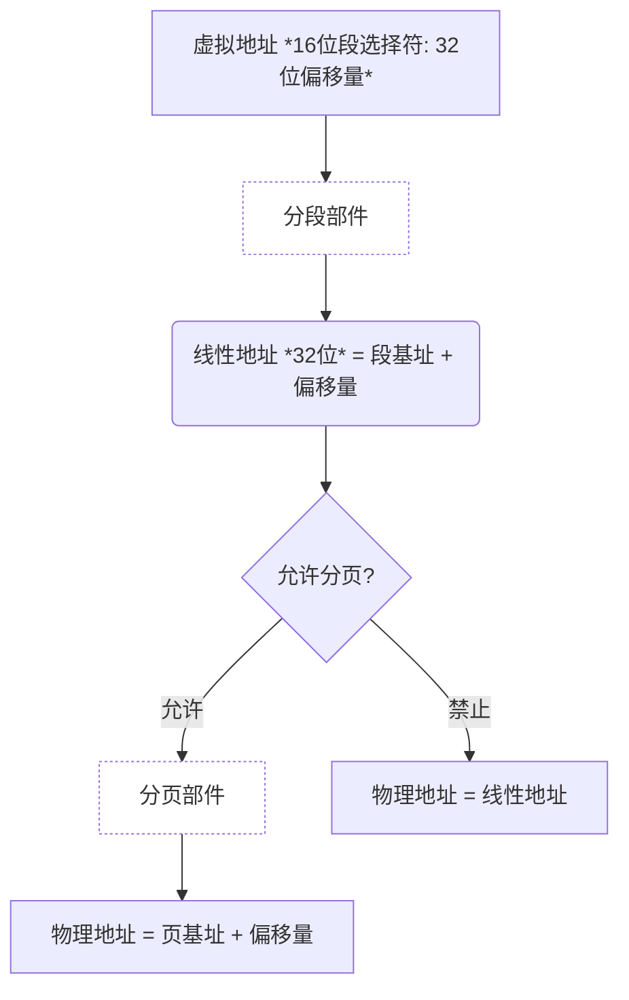
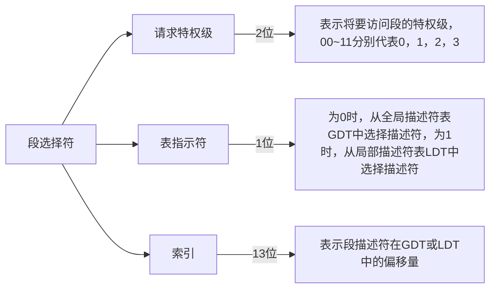

# 微处理器管理模式

## 地址变换

- 物理地址
  - 实际的数据地址，CPU通过地址总线访问该地址可以读取到该数据
- 逻辑地址
  - 通常由指令给出的地址，是一种相对地址，需要经过转换才能得到物理地址，32位下与虚拟地址的概念相同
- 线性地址
  - 32位环境下经过分段部件作用后所指向的内存区域地址。详细地址经过分页之后形成的地址为物理地址。
- 虚拟地址
  - 由段基址+偏移地址 *（偏移地址也叫有效地址）* 共同构成的一种形式上的地址 *（可以理解为`CS:EIP`的之类的格式）*




- 16位环境下，物理地址的表示范围是$2^{20}$Byte = 1MB，而逻辑地址的表示范围是$2^{16}$Byte = 64KB，无线性地址、虚拟地址的概念。
- 32位环境下，物理地址的表示范围是$2^{32}$Byte = 4GB，逻辑地址的表示范围是$2^{32}$Byte = 4GB，线性地址的表示范围是$2^{32}$Byte = 4GB，虚拟地址的表示范围是$2^{46}$Byte = 64TB，具体变换流程图可以参考上图。

> 虚拟地址虽然由16位**段选择符**和32位偏移量构成，但是16位段选择符中有2位是RPL，所以实际上只有14位，所以虚拟地址的表示范围是$2^{46}$Byte，而不是$2^{48}$Byte。

## 段选择符

段选择符的结构如下：

| 15-3 | 2 | 1 | 0 |
| :----: | :--: | :--: | :--: |
|  INDEX  |  TI |  RPL[0]  |  RPL[1]  |



## 段描述符

我们根据段选择符的索引和表指示符信息可以在内存中查到**段描述符**，段描述符的结构如下：

<div>
<!-- 生成一个段描述符的结构的表格 -->
<table>
    <tr>
        <td>+0</td>
        <td colspan="8" align=center>限长 (位7~0)</td>
    </tr>
    <tr>
        <td>+1</td>
        <td colspan="8" align=center>限长 (位15~8)</td>
    </tr>
    <tr>
        <td>+2</td>
        <td colspan="8" align=center>段基址 (位7~0)</td>
    </tr>
    <tr>
        <td>+3</td>
        <td colspan="8" align=center>段基址 (位15~8)</td>
    </tr>
    <tr>
        <td>+4</td>
        <td colspan="8" align=center>段基址 (位23~16)</td>
    </tr>
    <tr>
        <td>+5</td>
        <td colspan="1" align=center> P </td>
        <td colspan="2" align=center> DPL </td>
        <td colspan="1" align=center> S </td>
        <td colspan="1" align=center> W </td>
        <td colspan="1" align=center> C </td>
        <td colspan="1" align=center> R </td>
        <td colspan="1" align=center> A </td>
    </tr>
    <tr>
        <td>+6</td>
        <td colspan="1" align=center> G </td>
        <td colspan="1" align=center> D </td>
        <td colspan="1" align=center> 0 </td>
        <td colspan="1" align=center> AVL </td>
        <td colspan="4" align=center> 限长 (位19~16)</td>
    </tr>
    <tr>
        <td>+7</td>
        <td colspan="8" align=center>段基址 (位31~24)</td>
    </tr>
</table>
</div>

根据段基址我们就可以得到对应段的起始地址，然后加上偏移量就可以得到线性地址了。

## 例子

已知某时刻寄存器中的内容如下所示（16进制）：

```asm
CS=001BH
DS=0023H
ES=0023H
SS=0023H
FS=0030H
GS=0000H
GDTbase=E003F000H
Limit=03FFH
```

内存中部分地址的内容如下所示（16进制）

```asm
E003F000: 00 00 00 00 00 00 00 00-FF FF 00 00 00 9B CF 00
E003F010: FF FF 00 00 00 93 CF 00-FF FF 00 00 00 FB CF 00
E003F020: FF FF 00 00 00 F3 CF 00-AB 20 00 20 04 8B 00 80
E003F030: 01 00 00 F0 DF 93 C0 FF-FF 0F 00 00 00 F3 40 00
E003F040: FF FF 00 04 00 F2 00 00-00 00 00 00 00 00 00 00
```

有指令`JMP 000AH:00300030H`，试说明此刻的CPL，RPL和DPL各是多少，段基址是多少？
能否跳转成功？说明理由。

solution:

- 当前代码段寄存器CS的内容为001BH，<font color=blue>0000 0000 0001 1</font><font color=green>0</font><font color=red>11</font>B，所以Current Privilege Level(CPL)为3；
- 跳转指令为`JMP 000AH:00300030H`，段选择符为000AH，<font color=blue>0000 0000 0000 1</font><font color=green>0</font><font color=red>10</font>B，所以Requested Privilege Level(RPL)为2；
  - 观察到TI为0，所以是从GDT中选择段描述符，索引为1H，所以段描述符的地址为E003F000H + 1H * 8 = E003F008H；
- 段描述符的内容为`FF FF 00 00 00 9B CF 00`，
  - 其中DPL所在的字节为`9BH`，`1001 1011B`；
  - 对照可知Descriptor Privilege Level(DPL)为0；

<table>
<tr>
    <td colspan="1" align=center> P </td>
    <td colspan="2" align=center> DPL </td>
    <td colspan="1" align=center> S </td>
    <td colspan="1" align=center> W </td>
    <td colspan="1" align=center> C </td>
    <td colspan="1" align=center> R </td>
    <td colspan="1" align=center> A </td>
</tr>
</table>

- 由于 DPL < CPL，所以不满足特权级检查，所以不能跳转成功。

> 跳转成功的条件是DPL >= max(CPL, RPL)