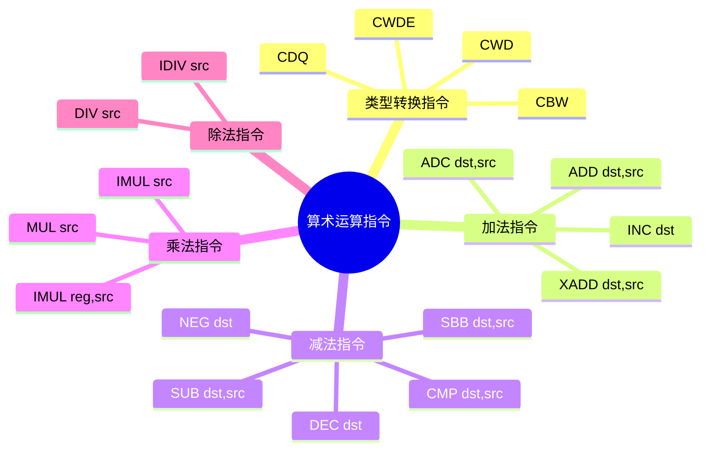
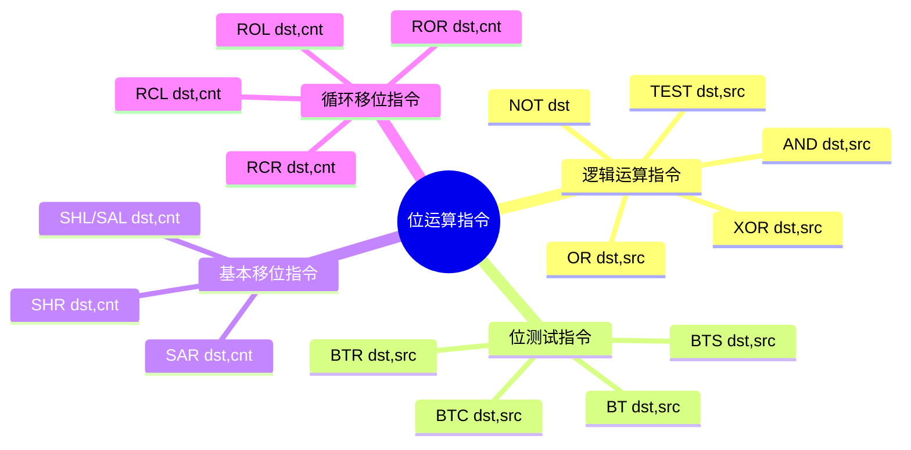

## 数据运算指令

### 二进制算术运算指令

<details>
<summary>
要学习的算术运算指令
</summary>



</details>

#### 类型转换指令

| 指令 | 中文名称 | 格式 | 功能描述 |
| --- | --- | --- | --- |
|CBW | 字节扩展成字指令 | `CBW` | 将`AL`中的有符号数扩展成字，填充到`AX`中 |
|CWD | 字扩展成双字指令 | `CWD` | 将`AX`中的有符号数扩展成双字，填充到`DX:AX`中 |
|CWDE | 字扩展成双字指令 | `CWDE` | 将`AX`中的有符号数扩展成双字，填充到`EAX`中 |
|CDQ | 双字扩展成四字指令 | `CDQ` | 将`EAX`中的有符号数扩展成四字，填充到`EDX:EAX`中 |

<details>
<summary>例子

`MOV AL,98H`，`CBW`，`AX`中的值是多少？
</summary>
    
```asm
MOV AL,98H
CBW
```

`AL`中的值是`98H`，最高位为1，符号扩展，`AX`中的值是`0FF98H`。

</details>

#### 二进制加法指令

| 指令 | 中文名称 | 格式 | 功能描述 | 标志位影响 |
| --- | --- | --- | --- | --- |
|ADD | 加法指令 | `ADD dst,src` | `(DST) = (DST) + (SRC)` | `OF`、`SF`、`ZF`、`AF`、`PF`、`CF` |
|ADC | 带进位加法指令 | `ADC dst,src` | `(DST) = (DST) + (SRC) + CF` | `OF`、`SF`、`ZF`、`AF`、`PF`、`CF` |
|INC | 加1指令 | `INC dst` | `(DST) = (DST) + 1` | 除`CF`外的同上标志位 |
|XADD | 交换并相加指令 | `XADD dst,src` | `tmp = (DST);`</br>`(DST) = (DST) + (SRC);`</br>`(SRC) = tmp` | `OF`、`SF`、`ZF`、`AF`、`PF`、`CF` |

<details>
<summary>例子</summary>

| 二进制数加法 | 无符号十进制数 | 有符号十进制数 | CF | OF |
| :---: | :---: | :---: | :---: | :---: |
| `  0000 0100`</br> `+ 0000 1011`</br>`-----------`</br>`  0000 1111` | `   4`</br>`+ 11`</br>`----`</br>`  15` | `   4`</br>`+ 11`</br>`----`</br>`  15`| `0` | `0` |
| `  0000 0111`</br> `+ 1111 1011`</br>`-----------`</br>`1 0000 0010` | `   7`</br>`+251`</br>`----`</br>` 258` | `   7`</br>`+ -5`</br>`----`</br>`   2`| `1` | `0` |
| `  0000 1001`</br> `+ 0111 1100`</br>`-----------`</br>`  1000 0101` | `   9`</br>`+124`</br>`----`</br>` 133` | `  9`</br>`+124`</br>`----`</br>`-123`| `0` | `1` |
| `  1000 0111`</br> `+ 1111 0101`</br>`-----------`</br>`1 0111 1100` | ` 135`</br>`+245`</br>`----`</br>` 124` | ` -121`</br>`+ -11`</br>`-----`</br>`  124`| `1` | `1` |

</details>

#### 二进制减法指令

| 指令 | 中文名称 | 格式 | 功能描述 | 标志位影响 |
| --- | --- | --- | --- | --- |
|SUB | 减法指令 | `SUB dst,src` | `(DST) = (DST) - (SRC)` | `OF`、`SF`、`ZF`、`AF`、`PF`、`CF` |
|SBB | 带借位减法指令 | `SBB dst,src` | `(DST) = (DST) - (SRC) - CF` | `OF`、`SF`、`ZF`、`AF`、`PF`、`CF` |
|DEC | 减1指令 | `DEC dst` | `(DST) = (DST) - 1` | 除`CF`外的同上标志位 |
|CMP | 比较指令 | `CMP dst,src` | `(DST) - (SRC)`**不改变**两个操作数的原值 | `OF`、`SF`、`ZF`、`AF`、`PF`、`CF` |
|NEG | 求补指令 | `NEG dst` | `(DST) = 0 - (DST)` | `OF`、`SF`、`ZF`、`AF`、`PF`、`CF` |

- 对于neg
  - 对8位操作数所能表示的最小值-128求补，依然为-128，但`0 - (-128) = 128`，所以`OF`为1
  - 当操作数为0时，`CF`为0，否则为1
    - 因为0的补码为0，所以`CF`为0
    - 0-其它任何非0数，都要借位，所以`CF`为1


#### 二进制乘法指令

| 指令 | 中文名称 | 格式 | 功能描述 | 标志位影响 |
| --- | --- | --- | --- | --- |
|MUL | 无符号乘法指令 | `MUL src` | `AX = AX * (SRC)` **只含一个源操作数**，另一个乘数必须事前放在累加器中| `CF`、`OF` 有意义，其它的也影响了|
|IMUL | 有符号乘法指令 | `IMUL src` | `AX = AX * (SRC)` 结果为带符号数| `CF`、`OF` 有意义，其它的也影响了|
|IMUL | 有符号乘法指令 | `IMUL reg,src` | `(reg) = (reg) * (SRC)` REG和SRC的长度必须相同，目标操作数REG必须是16位或32位通用寄存器| `CF`、`OF` 有意义，其它的也影响了|

| 乘法类型 | 功能描述 | 
| --- | --- |
| 字节型乘法 | `AX = AL * (SRC)_8` |
| 字型乘法 | `DX:AX = AX * (SRC)_16` |
| 双字型乘法 | `EDX:EAX = EAX * (SRC)_32` |

- 对CF和OF的影响是:若乘积的高半部分(例字节型乘法结果的AH)为0则对CF和OF清0，否则置CF和OF为1


#### 二进制除法指令

| 指令 | 中文名称 | 格式 | 功能描述 | 标志位影响 |
| --- | --- | --- | --- | --- |
|DIV | 无符号除法指令 | `DIV src` | `AX = AX / (SRC)` **只含一个源操作数**，不能是立即数，被除数必须事前放在隐含的寄存器中| 不确定|
|IDIV | 有符号除法指令 | `IDIV src` | `AX = AX / (SRC)` 结果为带符号数| 不确定|

| 除法类型 | 功能描述 |
| --- | --- |
| 字节型除法 | `AL = AX / (SRC)_8`</br>`AH = AX % (SRC)_8` |
| 字型除法 | `AX = DX:AX / (SRC)_16`</br>`DX = DX:AX % (SRC)_16` |
| 双字型除法 | `EAX = EDX:EAX / (SRC)_32`</br>`EDX = EDX:EAX % (SRC)_32` |

- 若除数为0或商超出操作数所表示的范围（例如字节型除法的商超出8位）会产生除法错中断,此时系统直接进入<font color=red>0号中断处理程序</font>

### 位运算指令

<details>
<summary>
要学习的位运算指令
</summary>


</details>

#### 逻辑运算指令

逻辑运算可以是8位、16位、32位,其寻址方式与MOV指令的限制相同

| 指令 | 中文名称 | 格式 | 功能描述 | 标志位影响 |
| :---: | :---: | :---: | :---: | :---: |
| NOT | 逻辑非 | `NOT dst` | `(DST) = ~(DST)` 按位取反| 不影响|
| AND | 逻辑与 | `AND dst,src` | `(DST) = (DST) & (SRC)` 按位与| `CF`和`OF`清0，影响SF、ZF、PF，AF不确定|
| TEST | 逻辑测试 | `TEST dst,src` | `(DST) & (SRC)` **不改变**两个操作数的原值| 同AND|
| OR | 逻辑或 | `OR dst,src` | `(DST) = (DST) \| (SRC)` 按位或| 同AND|
| XOR | 逻辑异或 | `XOR dst,src` | `(DST) = (DST) ^ (SRC)` 按位异或| 同AND|

#### 位测试指令

- bit test
- bit test and set
- bit test and reset
- bit test and complement

| 指令 | 中文名称 | 格式 | 功能描述 | 标志位影响 |
| :---: | :---: | :---: | :---: | :---: |
| BT | 位测试指令 | `BT dst,src` | 测试`dst`的第`src`位是否为1| `CF`被设置为`dst`的第`src`位的值，其它标志位不定|
| BTS | 位测试并置位指令 | `BTS dst,src` | 测试`dst`的第`src`位是否为1，若为1则不改变，若为0则置1| 同上|
| BTR | 位测试并复位指令 | `BTR dst,src` | 测试`dst`的第`src`位是否为1，若为1则置0，若为0则不改变| 同上|
| BTC | 位测试并取反指令 | `BTC dst,src` | 测试`dst`的第`src`位是否为1，若为1则置0，若为0则置1| 同上|

#### 基本移位指令

| 指令 | 中文名称 | 格式 | 功能描述 | 标志位影响 |
| :---: | :---: | :---: | :---: | :---: |
| SHL/SAL | 逻辑/算术左移指令 | `SHL/SAL dst,cnt` | `(DST) = (DST) << (CNT)` | `CF`中总是最后移出的一位，ZF、SF、PF按结果设置,当CNT＝ 1时,移位使符号位变化置1 则OF为1,否则清0 |
| SHR | 逻辑右移指令 | `SHR dst,cnt` | `(DST) = (DST) >> (CNT)`，高位补0 | 同上|
| SAR | 算术右移指令 | `SAR dst,cnt` | `(DST) = (DST) >> (CNT)`，高位补符号位 | 同上|

#### 循环移位指令

| 指令 | 中文名称 | 格式 | 功能描述 | 标志位影响 |
| :---: | :---: | :---: | :---: | :---: |
| ROL | 循环左移指令 | `ROL dst,cnt` | `(DST) = (DST) << (CNT)`，低位移出的位放入CF | `CF`中总是最后移进的一位，ZF、SF、PF按结果设置,当CNT＝ 1时,移位使符号位变化置1 则OF为1,否则清0 |
| ROR | 循环右移指令 | `ROR dst,cnt` | `(DST) = (DST) >> (CNT)`，高位移出的位放入CF | 同上|
| RCL | 带进位循环左移指令 | `RCL dst,cnt` | `(DST) = (DST) << (CNT)`，低位移出的位放入CF，CF移入高位 | 同上|
| RCR | 带进位循环右移指令 | `RCR dst,cnt` | `(DST) = (DST) >> (CNT)`，高位移出的位放入CF，CF移入低位 | 同上|

<details>
<summary>例子：把CX:BX:AX一组寄存器中的48位数据左移一个二进制位
</summary>

```asm
SHL AX,1
RCL BX,1
RCL CX,1
```

在没有溢出的情况下，以上程序实现了2×( CX:BX:AX)→CX:BX:AX的功能

</details>
