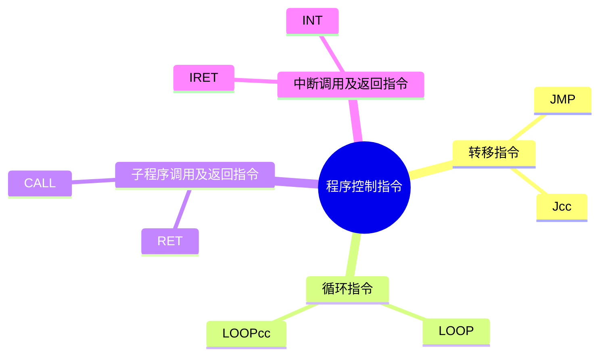

## 程序控制指令

> 均不影响标志位

<details>
<summary>
要学习的程序控制指令
</summary>


</details>

### 转移指令

| 指令 | 中文名称 | 格式 | 功能描述 | 说明 |
| --- | --- | --- | --- | --- |
| `JMP` | 无条件转移指令 | `JMP LABEL` | 无条件转移到LABEL所指向的地址 | LABEL为转移的目标地址（或称转向地址），使用与[转移地址有关的寻址方式](./转移寻址方式_star.md)可以形成目标地址。|
| `Jcc` | 条件转移指令 | `Jcc LABEL` | 根据标志位的状态转移到LABEL所指向的地址 | cc为条件，LABEL是要转向的标号，执行这类指令时通过检测由前边指令已设置的标志位确定是否转移，所以它们通常是跟在影响标志的指令之后。这类指令本身并不影响标志|

- 使用Jcc为短转移，LABEL范围为-128~127，位移量为8位

<details>
<summary>检测<b>单个标志位</b>的条件转移指令</summary>

| 格式 | 功能描述 | 测试条件 |
| :---: | :---: | :---: |
| `JC LABEL` | 进位时转移 | CF=1 |
| `JNC LABEL` | 无进位时转移 | CF=0 |
| `JO LABEL` | 溢出时转移 | OF=1 |
| `JNO LABEL` | 无溢出时转移 | OF=0 |
| `JP/JPE LABEL` | 奇偶校验位为1时转移 | PF=1 |
| `JNP/JPO LABEL` | 奇偶校验位为0时转移 | PF=0 |
| `JS LABEL` | 符号位为1时转移 | SF=1 |
| `JNS LABEL` | 符号位为0时转移 | SF=0 |
| `JZ/JE LABEL` | 结果为0/相等转移 | ZF=1 |
| `JNZ/JNE LABEL` | 结果不为0/不相等转移 | ZF=0 |

> 就是**J**MP 和 **X**F的结合**JX**，否定就是**JNX**

</details>


<details>
<summary>根据<b>两个<font color=red>带符号数</font>比较结果实现转移</b>的条件转移指令</summary>

| 格式 | 功能描述 | 测试条件 |
| :---: | :---: | :---: |
| `JG/JNLE LABEL` | 大于时转移 | ZF=0 and SF=OF |
| `JGE/JNL LABEL` | 大于等于时转移 | SF=OF |
| `JL/JNGE LABEL` | 小于时转移 | **SF≠OF** |
| `JLE/JNG LABEL` | 小于等于时转移 | ZF=1 or SF≠OF |

> 只要记住有符号小于时是**SF≠OF**就可以记住这个表格了，其它的无非就是和ZF组合

</details>

<details>
<summary>根据<b>两个<font color=red>无符号数</font>比较结果实现转移</b>的条件转移指令</summary>

| 格式 | 功能描述 | 测试条件 |
| :---: | :---: | :---: |
| `JA/JNBE LABEL` | 大于时转移 | CF=0 and ZF=0 |
| `JAE/JNB LABEL` | 大于等于时转移 | CF=0 |
| `JB/JNAE LABEL` | 小于时转移 | **CF=1** |
| `JBE/JNA LABEL` | 小于等于时转移 | CF=1 or ZF=1 |

> 只要记住无符号小于时是**CF=1**就可以记住这个表格了，其它的无非就是和ZF组合

</details>


<details>
<summary>测试<font color=red>CX／ECX值为0</font>转移指令</summary>

| 格式 | 功能描述 | 测试条件 |
| :---: | :---: | :---: |
| `JCXZ LABEL` | 适用于16位操作数转移 | CX = 0|
| `JECXZ LABEL` | 适用于32位操作数转移 | ECX = 0|

> 用于循环程序中判断循环计数的情况

</details>

<details>
<summary>例子：设M＝(EDX:EAX),N＝(EBX:ECX),比较两个64位数，若M＞N，则转向DMAX，否则转向DMIN。</summary>

```asm
; 无符号数
CMP EDX,EBX
JA DMAX
JB DMIN
CMP EAX,ECX
JA DMAX
DMIN:
DMAX:

; 有符号数
CMP EDX,EBX
JG DMAX ; JA -> JG
JL DMIN ; JB -> JL
CMP EAX,ECX
JA DMAX ; JA 不变
DMIN:
DMAX:
```

</details>

### 循环指令

| 指令 | 中文名称 | 格式 | 功能描述 | 说明 |
| --- | --- | --- | --- | --- |
| `LOOP` | 循环指令 | `LOOP LABEL` | `CX = (CX) - 1`，若不为0则转移到LABEL所指向的地址，否则顺序执行下一条指令| 若操作数长度为32位，则其中的CX应为ECX。在LOOP指令前，应先把循环计数的初始值送给CX（或ECX）|
| `LOOPcc` | 条件循环指令 | `LOOPcc LABEL` | `CX = (CX) - 1`，若不为0且cc条件成立则转移到LABEL所指向的地址，否则顺序执行下一条指令| 课件上只有LOOPE/LOOPZ和LOOPNE/LOOPNZ，其它同上|

<details>
<summary>例子：用累加的方法实现M×N，并把结果保存到RESULT单元</summary>

```asm
mov ax, 0       ; 用于累加的寄存器
mov bx, M       ; M
cmp bx, 0       ; 检测M是否为0
je L2           ; 若M为0，则跳转到L2
mov cx, N       ; 循环计数
jcxz L2         ; 若N为0，则跳转到L2
L1:
add ax, bx      ; 累加
loop L1         ; 循环
L2:
mov RESULT, ax  ; 结果保存到RESULT单元
```

</details>

### 子程序调用及返回指令

CALL和JMP差不多，但有几点区别
- CALL转移之后要返回，所以要把返回地址压栈；JMP不需要返回，所以不用压栈
- CALL不能使用短转移SHORT，因为短转移的位移量只有8位，不够存放返回地址的偏移量
- 其它的参考[JMP](./转移寻址方式_star.md)

| 指令 | 中文名称 | 格式 | 功能描述 | 说明 |
| --- | --- | --- | --- | --- |
| `CALL` | 子程序调用指令 | `CALL dst` | 将当前指令的下一条指令的地址(返回地址)送入堆栈，然后转移到dst所指向的地址 | 用于调用子程序，子程序执行完后，用RET指令返回到调用它的指令处继续执行。CALL指令的格式为CALL dst，其中dst为子程序的入口地址。|
| `RET` | 子程序返回指令 | `RET` | 按照CALL指令入栈的逆序，从栈顶弹出返回地址（弹出一个字到IP，若子程序是FAR型还需再弹出一个字到CS），然后返回到主程序继续执行。| 无论子程序是NEAR型还是FAR型，返回指令的汇编格式总是用RET表示。但经汇编后会产生不同的机器码。在DEBUG中，段间返回指令被反汇编成RETF。|
| `RET` | 子程序返回指令 | `RET imm16` | 按照CALL指令入栈的逆序，从栈顶弹出返回地址（弹出一个字到IP，若子程序是FAR型还需再弹出一个字到CS），然后返回到主程序继续执行。并修改栈顶指针`SP＝(SP)＋imm16`| 其中imm16是16位的立即数,设通过堆栈给子程序传递了n个字型参数，则imm16＝2n|

> 从之前还是现在都可以看到栈顶的移动是按照字节来的，由于是传递n个字型参数，所以SP的移动是2n
> - <font color=red>修改堆栈指针是为了废除堆栈中主程序传递给子程序的参数。</font>

### 中断调用及返回指令

- **中断**就是使计算机暂时挂起正在执行的进程而转去处理某种事件，
  - 处理完后再恢复执行原进程的过程
  - 对事件的处理就是一段程序，该程序被称为中断处理例行程序或中断处理子程序，
    - 简称为<font color=red>中断子程序</font>
- **中断向量**
  - 中断向量就是中断处理子程序的入口地址。在PC机中规定中断处理子程序为FAR型，所以每个中断向量占用**4个字节**，其中低两个字节为中断向量的偏移量部分,高两个字节为中断向量的段基址部分。
  - 中断类型号，IBM PC机共支持256种中断，相应编号为0~255，把这些编号称为中断类型号
- **中断向量表**
  - 256种中断有256个中断向量。
  - 把这些中断向量按照中断类型号由小到大的顺序排列，形成中断向量表。
  - 表长为4×256 ＝ 1024字节，
  - 该表从内存的0000:0000地址开始存放，从内存**最低端**开始存放
- 8086/8088中中断分为内中断和外中断
  - 内中断是指由CPU内部产生的中断，如除法溢出、单步执行、非法指令等
  - 外中断是指由CPU外部的设备产生的中断，如磁盘中断、打印机中断、键盘输入、串行通信接口的数据接收等
  - 这里只讨论内中断的中断调用指令


| 指令 | 中文名称 | 格式 | 功能描述 | 说明 |
| --- | --- | --- | --- | --- |
| `INT` | 中断调用指令 | `INT n` | 中断当前正在执行的程序，把当前的FLAGS、CS、IP值依次压入堆栈（保护断点）,并从中断向量表的4n处取出n类中断向量. | 其中`IP = (4n)` `CS = (4n+2)`，转去执行对应的n类中断处理子程序。|
| `IRET` | 中断返回指令 | `IRET` | 从栈顶弹出三个字分别送入IP、CS、FLAGS寄存器,把控制返回到原断点继续执行。| 无|
