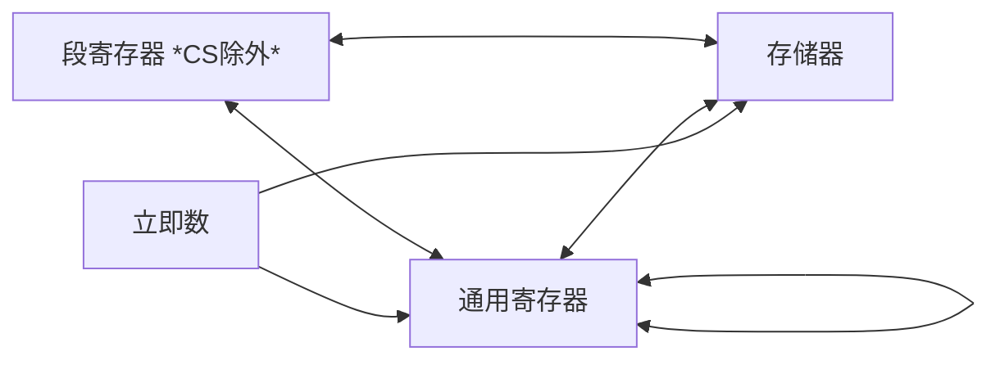

# 指令系统

## 寻址方式

| 寻址方式 | 例子 |
| --- | --- |
| 立即寻址方式 | MOV AX, 1234H |
| 寄存器寻址方式 | MOV AX, 1234H |
| 直接寻址方式 | MOV AX, [1234H] |
| 寄存器间接寻址方式 | MOV AX, [BX] |
| 寄存器相对寻址方式 | MOV AX, 8[BX] |
| 基址变址寻址方式 | MOV AX, [BX][SI] |
| 相对基址变址寻址方式 | MOV AX, ARRY[BX][SI] |
| 比例变址寻址方式 | MOV EAX, ES:ARRY[4*BX] |

小结：

- 寻址方式的对象可以是寄存器、立即数、内存单元；
- `立即数`  的寻址方式是立即寻址方式；
- `寄存器`  的寻址方式是寄存器寻址方式；
- `[立即数]`或`内存单元`的寻址方式是直接寻址方式，此时的立即数就是一个地址；
  - 比如`MOV VAR, 1234H`，就是将1234H送到VAR所在的内存单元中；
- `[寄存器]`的寻址方式是寄存器间接寻址方式，此时的寄存器中存放的是一个地址；
- `[寄存器+立即数]`或`立即数[寄存器]`的寻址方式是基址变址寻址方式，此时的寄存器中存放的是一个地址，立即数是一个偏移量；
- `[寄存器+寄存器]`或`[寄存器][寄存器]`的寻址方式是基址变址寻址方式，此时的两个寄存器中存放的是一个地址和一个偏移量；
- `[寄存器+寄存器+立即数]`或`立即数[寄存器][寄存器]`的寻址方式是相对基址变址寻址方式，此时的两个寄存器中存放的是一个地址和一个偏移量，立即数是一个偏移量；
- `[寄存器+寄存器*比例因子]`或`[寄存器][寄存器*比例因子]`的寻址方式是比例变址寻址方式，此时的两个寄存器中存放的是一个地址和一个偏移量，比例因子是一个常数。

## 通过习题理解各个段

*习题 3.4* 在实模式下 ，设(DS)=1000H， (ES)=2000H，(SS)=1200H，(BX)=0300H，
(SI)=0200H，(BP)=0100H，VAR 的偏移量为 0060H。若目标操作数为存储器操作数，试计
算下列各指令执行后目标操作数的物理地址是多少。

（1）`MOV AX,123` （2）`MOV DL,15`
（3）`MOV [BX],DX` （4）`MOV [0500H],DX`
（5）`MOV VAR,90H` （6）`MOV 6[BX],AX`
（7）`MOV 6[BP][SI],AL` （8）`MOV ES:[BX][SI],CX`

答案：

| 题号 | 物理地址 | 解析 |
| --- | --- | --- |
| (1) | --- | CPU 寻址，没有物理地址 |
| (2) | --- | CPU 寻址，没有物理地址 |
| (3) | 10300H | 数据段，可以写成`DS:[BX]`，所以物理地址为 1000H x 10H + 0300H = 10300H |
| (4) | 0500H | 数据段，可以写成`DS:[0500H]`，所以物理地址为 1000H x 10H + 0500H = 10500H |
| (5) | 10060H | 数据段，可以写成`DS:VAR`，所以物理地址为 1000H x 10H + 0060H = 10060H |
| (6) | 10306H | 数据段，可以写成`DS:[6+BX]`，所以物理地址为 1000H x 10H + 0306H = 10306H |
| (7) | 12306H | 堆栈段，可以写成`SS:[6+BP+SI]`，所以物理地址为 1200H x 10H + 6 + 0100H + 0200H = 12306H |
| (8) | 20306H | 附加段，可以写成`ES:[6+BX+SI]`，所以物理地址为 2000H x 10H + 0300H + 0200H = 20500H |

*习 题 3.5* 设 (DS)=2000H ， (SS)=3000H ， (CS)=1200H ， (BX)=0300H ， (IP)=0100H ，(20300H)=50H，(20301H)=01H，(20306H)=0BH，(20307H)=05H，试确定以下 JMP 指令转向的物理地址是多少。

（1）`JMP BX` （2）`JMP WORD PTR 6[BX]`

答案：

| 题号 | 物理地址 | 解析 |
| --- | --- | --- |
| (1) | 12300H | 代码段，可以写成`CS:[BX]`，所以物理地址为 1200H x 10H + 0300H = 12300H |
| (2) | 1250BH | 代码段，先到数据段取一个WORD，数据段地址可以写成`DS:[6+BX]`，数据段物理地址为 2000H x 10H + 6 + 0300H = 20306H，取出的WORD为 050BH，所以上面语句等效于`JMP 050BH`，所以物理地址为 1200H x 10H + 050BH = 1250BH |

## 其它

- `MOV AX,OFFSET MEM` 等效于 `LEA AX,MEM`，都是将MEM的偏移量（有效地址、偏移地址）送到AX中；

## 数据传送规则 

- 立即数不能作为目标操作数；
- 立即数不能直接送段寄存器；
- 目标寄存器不能是CS；
- 两个段寄存器间不能直接传送；
- 两个存储单元之间不能直接传送。

习题 指出错误

| 题号 | 语句 | 错误原因 |
| --- | --- | --- |
| (1) | `MOV [AX], BX` | 寄存器间接寻址方式不能用 AX 寄存器 |
| (2) | `MOV AL, 1280` | 源操作数超出目标范围 |
| (3) | `MOV [BX], 9` | 目标操作数类型未知 |
| (4) | `MOV DS, 1000H` | 立即数不能直接送段寄存器 |
| (5) | `MOV VAR, [BX]` | 两个操作数不能同时为存储器操作数 |
| (6) | `MOV M1, M2` | 两个操作数不能同时为存储器操作数 |
| (7) | `MOV 6, CX` | 目标操作数不能是立即数 |
| (8) | `MOV AX, [SI][DI]` | 源操作数寻址方式错 |
| (9) | `MOV CS, AX` | 目标操作数不能是代码段寄存器 |
| (10) | `MOV BX, OFFSET VAR[SI]` | OFFSET 后只能跟变量或标号名 |

