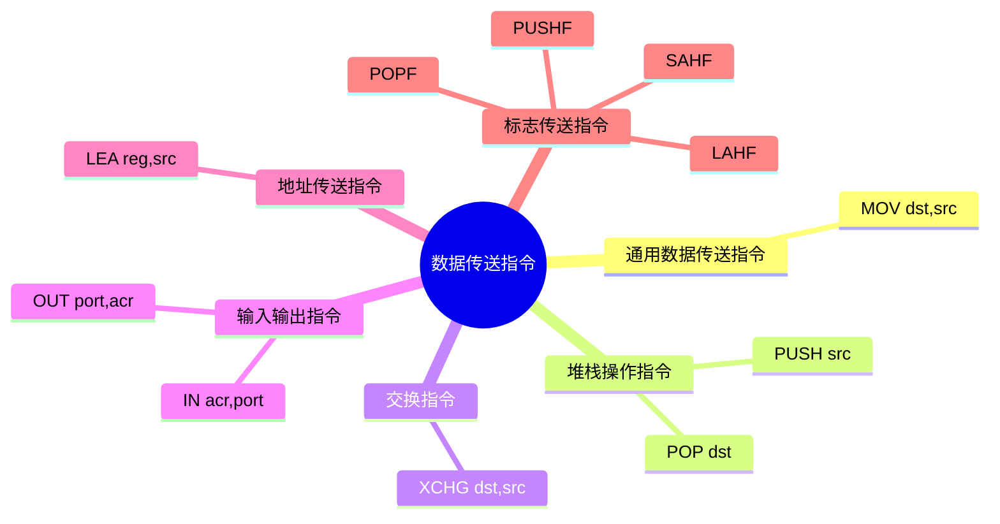

## 数据传送指令

了解数据传送指令之前，先学习一下操作数的类型。

| 操作数类型 | 例子 | 说明 |
| --- | --- | --- |
| 立即数 | `MOV AX,10` | 10是立即数 |
| 寄存器 | `MOV AX,BX` | BX是寄存器操作数 |
| 存储器 | `MOV AX,[BX]` | [BX]是存储器操作数 |

下面是这个章节要学习的一些数据传送指令。

<!-- MOV、PUSH、POP、XCHG、IN、OUT、LEA、PUSHF、POPF -->

| 指令 | 名称 | 格式 | 说明 |
| --- | --- | --- | --- |
| `MOV` | 通用数据传送指令 | `MOV dst,src` | 将源操作数送到目标操作数 |
| `PUSH` | 压栈指令 | `PUSH src` | 将源操作数送入堆栈 |
| `POP` | 出栈指令 | `POP dst` | 将堆栈中的数据送到目标操作数 |
| `XCHG` | 交换指令 | `XCHG dst,src` | 交换目标操作数和源操作数的内容 |
| `IN` | 输入指令 | `IN acr,port` | 从端口port输入一个字节或字到目标操作数 |
| `OUT` | 输出指令 | `OUT port,acr` | 将源操作数的内容送到端口port |
| `LEA` | 取有效地址指令 | `LEA reg,src` | 将源操作数的偏移地址送到指定寄存器 |
| `PUSHF` | 压栈标志指令 | `PUSHF` | 将标志寄存器的内容送入堆栈 |
| `POPF` | 出栈标志指令 | `POPF` | 将堆栈中的数据送到标志寄存器 |

### 通用数据传送指令

- 对于`mov`，需符合[数据传送规则](./数据传送规则.md) 
- `MOV WORD PTR [BX],10`这种
  - `WORD PTR`是指定BX所指向的内存单元为字型
  - 立即数10被汇编为16位的**字型**数，送入BX所指向的内存单元
  - 若要汇编为8位的**字节型**数，应写为`MOV BYTE PTR [BX],10`
- 带符号扩展的`movsx`指令
  - 将源操作数的低位扩展到目标操作数的高位
- 带零扩展的`movzx`指令
  - 将源操作数的低位扩展到目标操作数的高位，高位补0

### 堆栈操作指令

- 堆栈段段基址->`SS`，堆栈栈顶地址->`SP`/`ESP`
- `push src`
  - `SS:SP = (SRC)`
  - 如果src是16位字型，将src送入堆栈，`SP`减2
  - 如果src是32位双字型，将src送入堆栈，`SP`减4
- `pop dst`
  - `(DST) = SS:SP`
  - 如果dst是16位字型，将堆栈中的数据送入dst，`SP`加2
  - 如果dst是32位双字型，将堆栈中的数据送入dst，`SP`加4

### 交换指令

- `xchg dst,src`
  - `dst`和`src`可以是8位、16位或32位的寄存器操作数或存储器操作数

### 输入输出指令

- `in acr,port`
  - 从端口`port`输入一个字节或字到累加器`acr`
  - `port`是立即数或寄存器
  - 可以传送8位、16位或32位数据
    - 8位数据：`in al,20h`
    - 16位数据：`in ax,20h`
    - 32位数据：`in eax,20h` 
- `out port,acr`
  - 将累加器`acr`的内容送到端口`port`
  - `port`是立即数或寄存器
  - 可以传送8位、16位或32位数据
    - 8位数据：`out 20h,al`
    - 16位数据：`out 20h,ax`
    - 32位数据：`out 20h,eax`

### 地址传送指令

- `lea reg,src`
  - 将源操作数的偏移地址（有效地址）送到指定的寄存器
  - `src`是**存储器操作数**，`reg`是通用寄存器
  - `lea`指令不改变标志位
  - 例子
    - `LEA SI,TAB`
    - `LEA BX,TAB [SI]`
    - `LEA DI,ASCTAB [BX][SI]`

### 标志传送指令

> 考虑这些指令的结果对标志位的影响

- `pushf`
  - 16位标志进栈指令
  - 将标志寄存器的内容送入堆栈
  - 格式：`pushf`
  - 功能：`SP = SP - 2`，`栈顶 = FLAGS`
- `popf`
  - 16位标志出栈指令
  - 将堆栈中的数据送到标志寄存器
- `pushfd`
  - 32位标志进栈指令
  - 将标志寄存器的内容送入堆栈
  - 格式：`pushfd`
  - 功能：`SP = SP - 4`，`栈顶 = EFLAGS`
- 标志送AH指令
  - 将标志寄存器的内容(低8位)送入累加器AH
  - 格式：`lahf`
  - 功能：`AH = FLAGS[低8位]`
- AH送标志指令
  - 将累加器AH的内容送入标志寄存器(低8位)
  - 格式：`sahf`
  - 功能：`FLAGS[低8位] = AH`