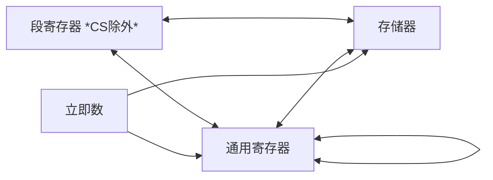

## 数据传送规则 

- 立即数不能作为目标操作数；
- 立即数不能直接送段寄存器；
- 目标寄存器不能是CS；
- 两个段寄存器间不能直接传送；
- 两个存储单元之间不能直接传送。

习题 指出错误

| 题号 | 语句 |
| --- | --- |
| (1) | `MOV [AX], BX` |
| (2) | `MOV AL, 1280` |
| (3) | `MOV [BX], 9` |
| (4) | `MOV DS, 1000H` |
| (5) | `MOV VAR, [BX]` |
| (6) | `MOV M1, M2` |
| (7) | `MOV 6, CX` |
| (8) | `MOV AX, [SI][DI]` |
| (9) | `MOV CS, AX` |
| (10) | `MOV BX, OFFSET VAR[SI]` |

| 题号 | 语句 | 错误原因 |
| --- | --- | --- |
| (1) | `MOV [AX], BX` | 寄存器间接寻址方式不能用 AX 寄存器 |
| (2) | `MOV AL, 1280` | 源操作数超出目标范围 |
| (3) | `MOV [BX], 9` | 目标操作数类型未知 |
| (4) | `MOV DS, 1000H` | 立即数不能直接送段寄存器 |
| (5) | `MOV VAR, [BX]` | 两个操作数不能同时为存储器操作数 |
| (6) | `MOV M1, M2` | 两个操作数不能同时为存储器操作数 |
| (7) | `MOV 6, CX` | 目标操作数不能是立即数 |
| (8) | `MOV AX, [SI][DI]` | 源操作数寻址方式错 |
| (9) | `MOV CS, AX` | 目标操作数不能是代码段寄存器CS |
| (10) | `MOV BX, OFFSET VAR[SI]` | OFFSET 后只能跟变量或标号名 |

