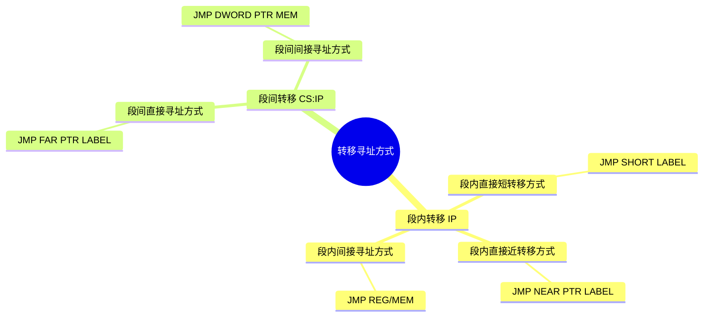

## 转移寻址方式

> 主要就是改变`IP`的值 （`IP`是指令指针寄存器 Instruction Pointer）

<details>
<summary>
要学习的与转移地址有关的寻址方式
</summary>



</details>

### 段内直接寻址方式

- 转向的有效地址是当前指令指针寄存器的内容和指令中指定的**8位、16位位移量**之和，该位移量是一个相对于指令指针的**带符号数**
  - 如果是8位位移量，那么`EA = IP + 8位disp`，(EA是有效地址 Effective Address)
    - 又叫段内无条件短转移指令
    - 例子：`JMP SHORT LABEL`
      - `LABEL`是一个标号，编译器会将其编译为一个相对于当前指令指针的8位位移，因为是有符号数，所以可以表示-128~127
  - 如果是16位位移量，那么`EA = IP + 16位disp` 
    - 又叫段内无条件近转移指令
    - 例子：`JMP NEAR LABEL` 或 `JMP LABEL`
      - `LABEL`是一个标号，编译器会将其编译为一个相对于当前指令指针的16位位移，因为是有符号数，所以可以表示-32768~32767

<table>
    <tr>
        <th colspan="1" align=center>
            段内短转移方式
        </th>
        <th colspan="1" align=center>
            字节0
        </th>
        <th colspan="1" align=center>
            字节1
        </th>
    </tr>
    <tr>
        <th colspan="1" align=center>
            指令
        </th>
        <td colspan="1" align=center>
            JMP操作码
        </td>
        <td colspan="1" align=center>
            disp
        </td>
    </tr>
</table>

<table>
    <tr>
        <th colspan="1" align=center>
            段内直接寻址方式
        </th>
        <th colspan="1" align=center>
            字节0
        </th>
        <th colspan="1" align=center>
            字节1
        </th>
        <th colspan="1" align=center>
            字节2
        </th>
    </tr>
    <tr>
        <th colspan="1" align=center>
            指令
        </th>
        <td colspan="1" align=center>
            JMP操作码
        </td>
        <td colspan="1" align=center>
            disp_low
        </td>
        <td colspan="1" align=center>
            disp_high
        </td>
    </tr>
</table>

### 段内间接寻址方式

| 格式 | 举例 | 说明 |
| :---: | :---: | :---: |
| `JMP REG` | `JMP BX` | 16位转向地址在BX中 |
| `JMP MEM` | `JMP WORD PTR VAR` </br> `JMP WORD PTR [BX]` | 16位转向地址在VAR字型变量中 </br> 16位转向地址在BX所指向的内存单元中 |

<details>
<summary>具体例子

设：（DS）＝ 2000H，（BX）＝0300H（IP）＝0100H，（20300H）＝000BH（20301H）＝0005H，（1）求执行`JMP BX`后的IP为多少；（2）求`JMP WORD PTR [BX]`之后的IP
</summary>

（1）执行后（IP）＝（BX）＝ 0300H

（2）`[BX]`的对应物理地址为`DS:BX = 2000:0300H = 2000H x 10H + 0300H = 20300H`，从中取出一个字型数据为`000BH`，则有效地址`EA = 000BH`，则`(IP) = EA = 000BH`，下一次代码从`CS:IP`中开始执行，就实现了段内间接转移
</details>

### 段间直接寻址方式

- 指令给出段基址section_base和偏移量offset，送给CS和IP即可实现段间转移

<table>
    <tr>
        <th colspan="1" align=center>
            段间直接寻址方式
        </th>
        <th colspan="1" align=center>
            字节0
        </th>
        <th colspan="1" align=center>
            字节1
        </th>
        <th colspan="1" align=center>
            字节2
        </th>
        <th colspan="1" align=center>
            字节3
        </th>
        <th colspan="1" align=center>
            字节4
        </th>
    </tr>
    <tr>
        <th colspan="1" align=center>
            指令
        </th>
        <td colspan="1" align=center>
            JMP操作码
        </td>
        <td colspan="1" align=center>
            offset_low
        </td>
        <td colspan="1" align=center>
            offset_high
        </td>
        <td colspan="1" align=center>
            section_base_low
        </td>
        <td colspan="1" align=center>
            section_base_high
        </td>
    </tr>
</table>

### 段间间接寻址方式

和上面图一样，只不过这里可以用一个双字内存变量代替，低十六位为IP，高十六位为CS

<details>
<summary>例子：

```asm
(DS)＝ 2000H
(BX) ＝ 0300H
(IP) ＝ 0100H
(20300H) ＝ 0
(20301H) ＝ 05H
(20302H) ＝ 10H
(20303H) ＝ 60H
```

`JMP DWORD PTR [BX]`执行之后，下一次代码从什么地方开始执行？

</summary>

`[BX]`的对应物理地址为`DS:BX = 2000:0300H = 2000H x 10H + 0300H = 20300H`，从中取出一个双字型数据为`60100500H`，则段基址:有效地址为`60100500H`，则`(CS) = 6010 (IP) = 0500H`，下一次代码从`CS:IP`即6010:0500H处中开始执行，就实现了段间间接转移

</details>

> 段间转移的目标地址采用48位全指针形式，即32位的偏移量和16位的段选择子


<details>
<summary>
*习 题 3.5* 设 (DS)=2000H ， (SS)=3000H ， (CS)=1200H ， (BX)=0300H ， (IP)=0100H ，(20300H)=50H，(20301H)=01H，(20306H)=0BH，(20307H)=05H，试确定以下 JMP 指令转向的物理地址是多少。

（1）`JMP BX` （2）`JMP WORD PTR 6[BX]`
</summary>
答案：

| 题号 | 物理地址 | 解析 |
| --- | --- | --- |
| (1) | 12300H | 代码段，可以写成`CS:[BX]`，所以物理地址为 1200H x 10H + 0300H = 12300H |
| (2) | 1250BH | 代码段，先到数据段取一个WORD，数据段地址可以写成`DS:[6+BX]`，数据段物理地址为 2000H x 10H + 6 + 0300H = 20306H，取出的WORD为 050BH，所以上面语句等效于`JMP 050BH`，所以物理地址为 1200H x 10H + 050BH = 1250BH |
</details>