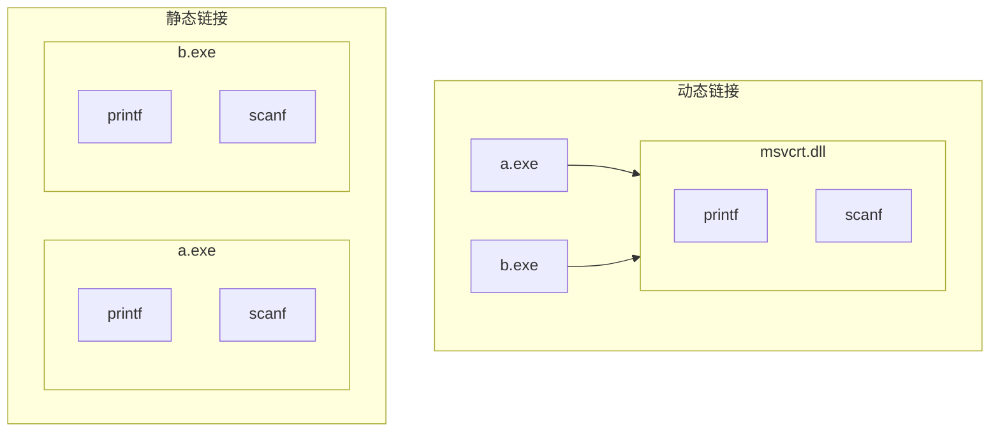

## Windows汇编语言程序设计


<details>
<summary>控制台界面的汇编源程序</summary>

```asm
;模式定义
.386
.model flat,stdcall
option casemap:none

;库文件及函数声明
includelib msvcrt.lib
printf	PROTO C :ptr sbyte,:VARARG ;或者使用include
scanf PROTO C :dword,:vararg


;数据部分
.data
szMsg	byte	'Hello World',0ah,0

;代码部分
.code
start:
	invoke printf, offset szMsg
	ret
end start
```

</details>

<details>
<summary>窗口界面的汇编源程序</summary>

```asm
;模式定义
.386
.model flat.stdcall
option casemap:none

;库文件及函数声明
includelib user32.lib
MessageBoxA PROTO stdcall :dword,:dword,:dword,:dword 
MessageBox equ <MessageBoxA>

;数据部分
.data
SzTitle	byte	'Hi!'
SzMsg	byte	'Hello World',0

;代码部分
.code
start:
	invoke MessageBox,\
		   NULL,\           ;HWND hWnd
		   offset szMsg,\   ;LPCSTR lpText
		   offset szTitle,\ ;LPCSTR lpCaption
		   MB_OK            ;UINT uType
	ret
end start
```

</details>

### 对上面两个程序的分析

<details>
<summary>1. 模式定义

```asm
.386                    ; .386语句定义了程序使用80386指令集。
.model flat,stdcall     ; .model flat, stdcall语句。
option casemap:none     ; option语句，不对大小写敏感
```
</summary>
option语句有许多选项，例如option language、option segment等，在Win32中需要定义option casemap:none，用以说明程序中的变量和子程序名是否对大小写敏感

</details>

<details>
<summary>2. includelib语句

```asm
includelib msvcrt.lib
```
</summary>

- `includelib`语句用于指定库文件，以便在程序中调用库函数。在Win32中，库文件的扩展名为`.lib`，例如`msvcrt.lib`是C语言运行库文件，包含了`printf、scanf`等函数的定义。
  - 动态链接则是在程序运行时才将库函数链接到程序中，这样可以减少程序的体积，但是程序运行时需要加载库函数，因此运行速度较慢。
  - 静态链接则是在程序编译时就将库函数链接到程序中，这样可以提高程序的运行速度，但是程序的体积较大。



</details>

<details>
<summary>3. 函数声明

```asm
printf	PROTO C :ptr sbyte,:VARARG ;或者使用include
scanf PROTO C :dword,:vararg
```
</summary>

- `函数名称 PROTO [调用规则] :[第一个参数类型] [,:后续参数类型]`
- 在汇编语言中，用`ptr sbyte`代表`const char *`
- `printf PROTO C :ptr sbyte, :VARARG`
- 函数声明后，就可以用`INVOKE`伪指令来调用

</details>

<details>
<summary>4. include语句

```asm
include kernel32.inc
include user32.inc
```
</summary>

- 在这里其实也可以`include msvcrt.inc`，就不用函数声明了
  - 但这里面的函数声明是`crt_scanf`和`crt_printf`

</details>

<details>
<summary>5. 数据部分

```asm
.data
szMsg	byte	'Hello World',0ah,0
```
</summary>

- 程序中的数据部分从`.data`语句开始定义，代码部分从`.code`语句开始定义，所有的指令都必须写在代码区中。
- 在编程时，不能把那些需要修改的变量放到`.code`部分。

</details>

<details>
<summary>6. 程序结束

```asm
.code
start:
	invoke printf, offset szMsg
	ret
end start
```
</summary>

- 与DOS程序相同，Win32程序在遇到end语句时结束。end语句后面跟的标号指出了程序执行的入口点，即装入执行的第一条指令的位置，表示源程序结束。
- 语句格式：`END [过程名]`

</details>

<details>
<summary>7. 跨行

```asm
invoke MessageBox,\
    NULL,\           ;HWND hWnd
    offset szMsg,\   ;LPCSTR lpText
    offset szTitle,\ ;LPCSTR lpCaption
    MB_OK            ;UINT uType
ret
```
</summary>

</details>

<details>
<summary>8. 程序中的数据归类</summary>

1. 可读可写的初始变量
2. 可读可写的未初始变量:
    - `buffer byte 65536 dup (?)`
3. 常量数据
    - `szMsg byte “Hello World!”, 0ah, 0`

</details>

<details>
<summary>9. invoke伪指令相当于Call

```asm
invoke printf, offset szMsg
```
</summary>

- 格式：`invoke 函数名[,参数1] [,参数2]`
- 功能：调用函数或子程序。

</details>

### 输入输出有关的Windows API函数

<details>
<summary>1. <code>printf</code></summary>

```asm
.386
.model flat,stdcall
option casemap:none
includelib msvcrt.lib
printf PROTO C :ptr sbyte,:vararg
printf PROTO C :dword,:vararg

.data
szOut byte 'x=%d n=%d x(n)=%d', 0ah, 0
x dd 0
n dd 0
p dd 0

.code
start:
    ; printf ("x=%d n=%d x(n)=%d\n" , x, n, p);
    invoke printf, offset szOut, x, n, p
    ret
end start
```

</details>

<details>
<summary>2. <code>scanf</code></summary>

```asm
.386
.model flat,stdcall
option casemap:none
includelib msvcrt.lib
scanf PROTO C :dword,:vararg

.data
szInFmtStr byte '%d %c %d', 0
a dd ?
b db ?
d dd ?

.code
start:
    ; scanf("%d %c %d", &a, &b, &d);
    invoke scanf, offset szInFmtStr, offset a, offset b, offset d
    ret
end start
```

</details>

<details>
<summary>3. <code>MessageBoxA</code></summary>

```asm
;模式定义
.386
.model flat.stdcall
option casemap:none

;库文件及函数声明
includelib user32.lib
MessageBoxA PROTO stdcall :dword,:dword,:dword,:dword 

;数据部分
.data
SzTitle	byte	'Hi!'
SzMsg	byte	'Hello World',0

;代码部分
.code
start:
	invoke MessageBoxA,\
		   NULL,\           ;HWND hWnd        窗口句柄
		   offset szMsg,\   ;LPCSTR lpText    消息框正文的指针
		   offset szTitle,\ ;LPCSTR lpCaption 消息框窗口标题的指针
		   MB_OK            ;UINT uType       消息框类型
	ret
end start
```

</details>