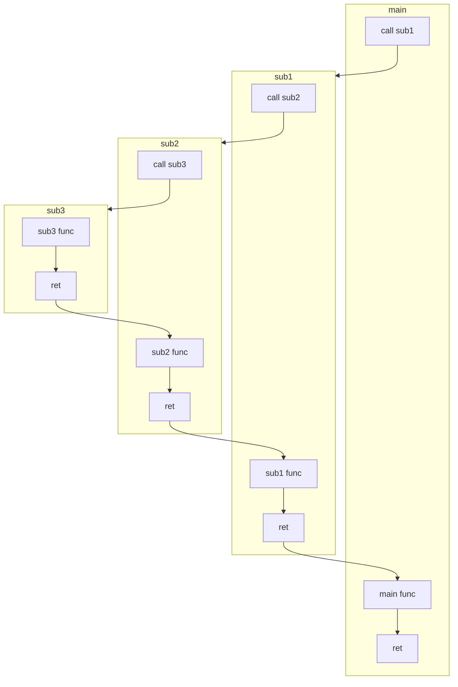

## 子程序特殊应用

### 子程序嵌套

在汇编语言中，允许子程序作为调用程序去调用另一子程序，把这种关系称为子程序嵌套

<details>
<summary>子程序嵌套示意图</summary>



</details>

由于子程序嵌套对堆栈的使用很频繁，因此还要确保堆栈有足够空间，并要注意堆栈的正确状态，这包括`CALL, RET, RET N, PUSH, POP, INT, IRET`等与堆栈操作有关指令的正确使用。

### 子程序递归

```asm
factorial proc C n:dword
    cmp n, 1
    jbe exitrecurse
    mov ebx, n              ;EBX = n
    dec ebx                 ;EBX = n-1
    invoke factorial, ebx   ;EAX = (n-1)!
    imul n                  ;EAX = EAX * n
    ret                     ; = (n-1)! * n = n!
exitrecurse:
    mov eax, 1              ;n = 1时, n! = 1
    ret
factorial endp

start proc
    local n,f:dword
    mov n, 5
    invoke factorial,n      ;EAX=n!
    mov f, eax
    invoke printf, offset szOut, n, f
    ret
start endp
end start
```

### 缓冲区溢出

```asm
.386
.model flat,stdcall
includelib msvcrt.lib
printf PROTO C:dword,:vararg
scanf PROTO C:dword,:vararg
.data
szMsg byte 'f is called. buf=%s', 0ah, 0
szFormat byte '%s', 0
buf byte 40 dup (0)
fn dword offset f
.code
f proc
    invoke printf, offset szMsg, offset buf
    ret
f endp
start:
    invoke scanf, offset szFormat, offset buf
    call dword ptr [fn]
    invalidarg:
    ret
end start
```

- 当输入的字符长度超过40个字节以后，后面的fn就被覆盖。执行`call dword ptr [fn]`指令时，从fn单元中取出的内容就不再是子程序f的地址