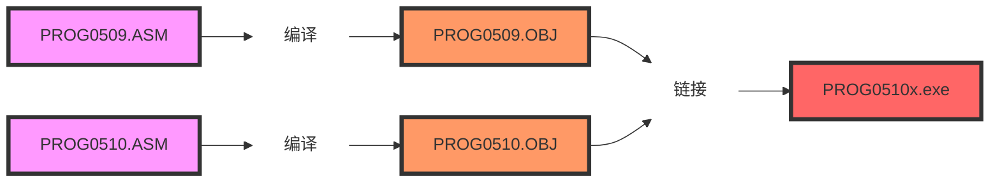

## 模块化程序设计

如果有多个源程序文件，或者需要使用C/C++、汇编等多种语言混合编程，就需要对这些源程序分别编译，最后连接构成一个可执行文件。

在子程序设计中，主程序和子程序之间可以通过全局变量、寄存器、堆栈等方式传递数据，这种技术在模块化程序设计中同样适用。

由于各个模块需要单独汇编，于是就会出现当一个模块通过名字调用另一模块中的子程序或使用其数据时，这些名字对于调用者来讲是未定义的，因此在汇编过程中就会出现符号未定义错误。可以通过伪指令`EXTRN、PUBLIC`等来解决。

1. 外部引用伪指令EXTRN
   - 格式：`EXTRN 变量名:类型[,...]`
   - 功能：说明在本模块中用到的变量是在另一个模块中定义的，同时指出变量的类型。
2. 全局符号说明伪指令PUBLIC
   - 格式：`PUBLIC 名字[,...]`
   - 功能：告诉汇编程序本模块中定义的名字可以被其他模块使用。这里的名字可以是变量名，也可以是子程序名
3. 子程序声明伪指令PROTO
   - 格式：`子程序名 PROTO [C | stdcall] :[第一个参数类型] [,:后续参数类型]`
   - 功能：说明子程序的名字和参数类型，供主程序调用。在前面的程序中，已经多次使用这种方式调用C语言的库函数及Windows的API

```asm
;PROG0509.ASM
.386
.model flat,stdcall
option casemap:none
includelib msvcrt.lib
printf PROTO C :dword,:vararg
SubProc PROTO stdcall :dword, :dword    ;SubProc位于其他模块中
public result                           ;允许其他模块使用result
.data
szOutputFmtStr byte '%d?%d=%d', 0ah, 0  ;输出结果
oprd1 dword 70                          ;被减数
oprd2 dword 40                          ;减数
result dword ?                          ;差
.code
main proc C argc, argv
    invoke SubProc, oprd1, oprd2        ;调用其他模块中的函数
    invoke printf, offset szOutputFmtStr, \ ;输出结果
        oprd1, \
        oprd2, \
        result ;result由SubProc设置
    ret
main endp
end
```

```asm
;PROG0509.ASM
.386
.model flat,stdcall
public SubProc ;允许其他模块调用SubProc
extrn result:dword ;result位于其他模块中
.data
.code
SubProc proc stdcall a, b ;减法函数, stdcall调用方式
    mov eax, a ;参数为a,b
    sub eax, b ;EAX=a-b
    mov result, eax ;减法的结果保存在result中
    ret 8 ;返回a-b
SubProc endp
end
```



```shell
ml /c /coff prog0509.asm
ml /c /coff prog0510.asm
link prog0509.obj prog0510.obj /out:prog0510x.exe /subsystem:console
```