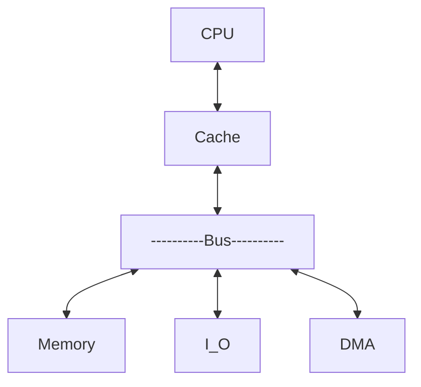
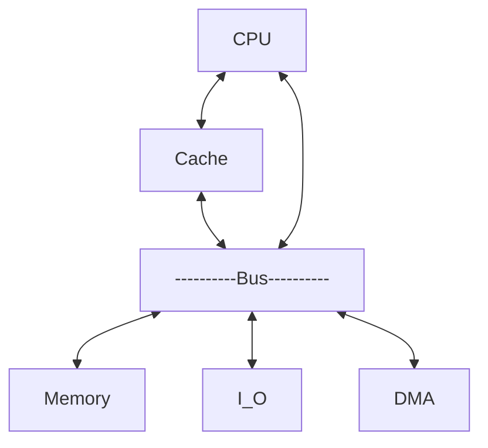

## Cache工作原理

- Cache：SRAM构成
  - **SRAM** ：1～2时钟周期读写一次数据（Cache）
  - **DRAM** ：多个时钟周期读写一次数据（RAM/主存）
- Cache的局部性原理
  - **时间局部性** ：Cache访问速度
  - **空间局部性** ：Cache访问容量
- Cache的访问结构
  - **贯通查找式** （Look Through）结构
  - **旁路读出式** （Look Aside）结构

- Cache访问结构


<table>
<tr>
<td colspan="1" align=center>
<details>
<summary>a. Look Through结构</summary>



```
cache平均访问时间 = cache访问时间 +（1-命中率）× 未命中时主存访问时间
```

</details>
</td>
<td colspan="1" align=center>
<details>
<summary>b. Look Aside结构</summary>



```
cache平均访问时间 = 命中率 × cache访问时间 +（1-命中率）× 未命中时主存访问时间
```

</details>
</td>
</tr>
</table>

- Cache映射
  - 主存和Cache之间一次交换的数据单位是**一个数据块**；
  - 数据块大小固定，由若干个字组成，**主存和Cache的数据块大小相同**；
  - Cache对程序员透明，CPU的**访主存地址需转换成访Cache地址**；
  - 主存地址与Cache地址之间的转换是与主存块与Cache块之间的**映射关系紧密联系**
  - 全相联映射
  - 直接相联映射
  - 组相联映射

- Cache替换策略
  - 主存的一个块要调入Cache存储器时，如果Cache存储器中没有空闲的行，就必须从中选取一行，用新的块覆盖其原有的内容。这种替换应该遵循一定的规则，其目标是选取在下一段时间内被存取的可能性最小的块，替换出Cache。
  - <font color=red>随机算法、先进先出（FIFO）算法和近期最少使用（LRU）算法</font>
- 微机中的Cache
  - 一级缓存（L1 cache）：一级缓存中采哈佛结构，分为数据缓存（Data Cache，D-Cache）和指令缓存（Instruction Cache，I-Cache），分别用来存放数据和指令。
  - 二级缓存（L2 Cache）
  - 三级缓存（L3 Cache）
  - 追踪缓存（Execution Trace Cache，T-Cache或ETC）：P4中替代一级指令缓存，容量为12KμOps（μOps，微指令），能存储12000条解码后的微指令。
