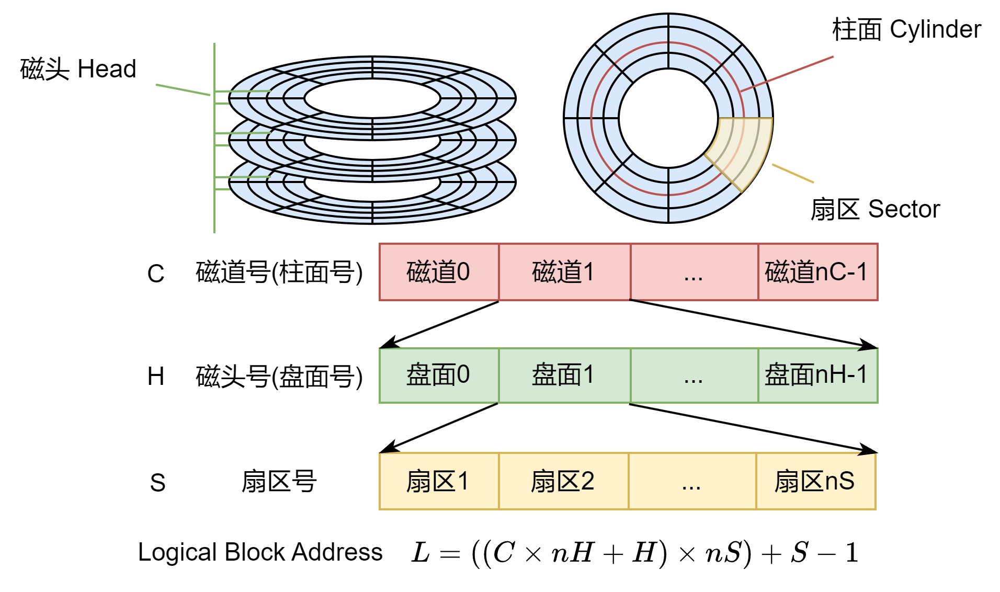

## 辅助存储器/扇区编址



- 工作原理
  - 磁盘片/2个盘面
  - 磁道：<font color=red>0磁道是硬盘上非常重要的位置</font>。硬盘的主引导记录区（Main Boot Record，MBR）就保存在0磁头0柱面1扇区。
  - 扇区：<font color=red>扇区是最小的读写单位</font>，每个扇区中的数据作为一个单元同时读出或写入，扇区从1开始编号。
- ATA接口的编程模型：扇区编制模式CHS
  - N个盘面对应2N个磁头，磁头：0, 1,2, ... , nH         (H = Head)
  - N个磁道对应N个柱面，柱面：0, 1,2, ... , nC          (C = Cylinder)
  - 每个磁道又被分为多个扇区，扇区：1, 2,3, ... , nS     (S = Sector)
  - 总nC×nH×nS个扇区
  - 0柱面0磁头1扇区是整个硬盘的第1个扇区 <C,H,S> = <0,0,1>
  - 每个扇区512字节
- LBA编址模式与CHS编制模式互换
  - 设一个扇区在LBA编址模式中的地址为L，在CHS编址模式的地址
为<C，H，S>，0≤C≤nC−1，0≤H≤nH−1，1≤S≤nS，则`L=[(C×nH + H)×nS]+S–1`。
  - 根据L计算<C，H，S>：

```c
S =(L % nS) + 1
H =(L / nS) % nH
C =(L / nS) / nH
```

<details>
<summary>例题：假设一个磁道共有2048个柱面，16个磁头，每个磁道分为64个扇区，每个扇区512字节，该磁盘的总容量共有多少GB?假设一个磁盘的一个逻辑盘块大小为2KB，则逻辑盘块号513所对应的首个扇区的三维物理地址是多少？</summary>

解答：

- 扇区总数：2048×16×64 = 2^11×2^4×2^6=2^21
- 总容量：2^21×512B=2^21×2^9B=2^30B=1GB
- 因为逻辑盘块大小为2KB，所以一个逻辑盘块对应2x1024/512=4个扇区
- 逻辑盘块号513对应的首个扇区的物理地址L为：
  - L = 513x4+1 = 2053
- 根据L计算<C，H，S>：
  - 由`L=[(C×nH + H)×nS]+S–1`得：
  - S = (2053 % 64) + 1 = 6
  - H = (2053 / 64) % 16 = 0
  - C = (2053 / 64) / 16 = 2
- 所以逻辑盘块号513所对应的首个扇区的三维物理地址是<C，H，S> = <2,0,6>

</details>