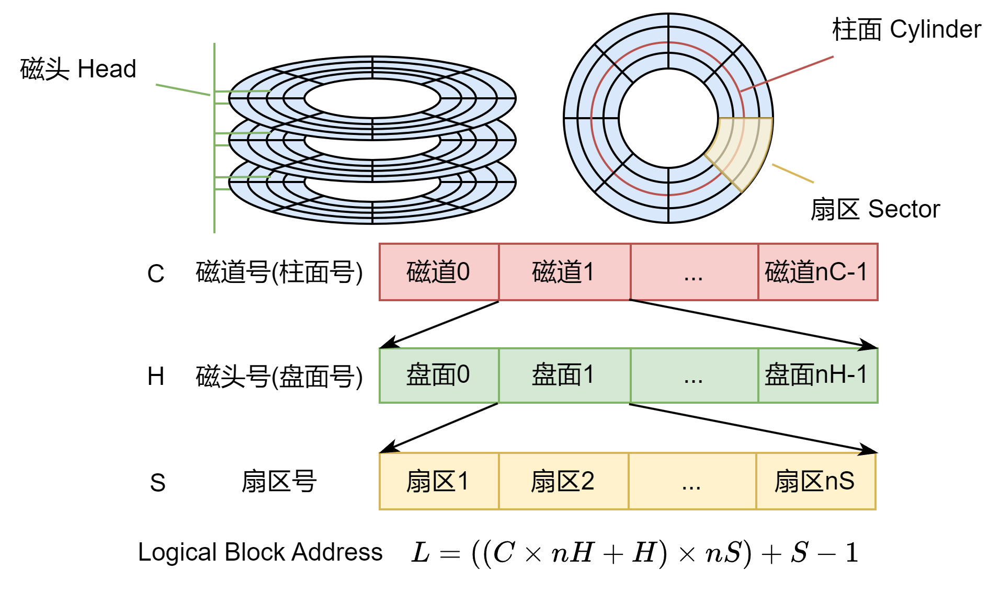

## 习题

6.1 简述现代微机的存储系统构成

现代计算机系统常采用寄存器、高速缓存、主存、外存的多级存储体系结构。

- 内部存储器（内存）主要存储计算机当前工作需要的程序和数据
  - 包括高速缓冲存储器 (Cache 缓存)和主存储器 (Main Memory 主存)
  - 目前构成内存的主要是半导体存储器
- 外部存储器（外存）主要有磁性存储器、光存储器和半导体存储器三种实现方式，存储介质有硬磁盘、光盘磁带和移动存储器等

6.3 简述Cache的工作原理

1. 局部性原理；
   1. 时间局部性：访问过的数据很可能再次访问
   2. 空间局部性：数据和程序集中存放 地址邻近
2. Cache的访问结构；
   1. 贯通查找式：Cache位于CPU和主存之间，CPU对主存的所有数据请求都先发送到Cache，由Cache自行查找
   2. 旁路读出式：Cache不再位于CPU和主存之间，CPU发出数据请求，是向Cache和主存同时发出。
3. Cache映射；
   - Cache映射
   - 主存和Cache之间一次交换的数据单位是**一个数据块**；
   - 数据块大小固定，由若干个字组成，**主存和Cache的数据块大小相同**；
   - Cache对程序员透明，CPU的**访主存地址需转换成访Cache地址**；
   - 主存地址与Cache地址之间的转换是与主存块与Cache块之间的**映射关系紧密联系**
4. Cache替换策略
   - 随机算法、先进先出（FIFO）算法和近期最少使用（LRU）算法 

6.4 简述内存的分类

内存可分为只读存储器（Read-Only Memory, ROM）和随机存储器（Random Access Memory, RAM）两大类。

- ROM通常用来存储不需要改变的程序或数据
  - 掩模式只读存储器（Mask ROM）
  - 可编程只读存储器（Programmable ROM, PROM）
  - 可擦除可编程只读存储器（Erasable Programmable ROM, EPROM）
  - 闪存（Flash Memory）
- RAM只能暂时保存数据，断电后数据丢失
    - 双极型
    - MOS型
      - 静态RAM（SRAM）
      - 动态RAM（DRAM）

6.8 假设一个磁道共有2048个柱面，16个磁头，每个磁道分为64个扇区，每个扇区512字节，该磁盘的总容量共有多少GB?假设一个磁盘的一个逻辑盘块大小为2KB，则逻辑盘块号513所对应的首个扇区的三维物理地址是多少？

解答：

- 扇区总数：2048×16×64 = 2^11×2^4×2^6=2^21
- 总容量：2^21×512B=2^21×2^9B=2^30B=1GB
- 因为逻辑盘块大小为2KB，所以一个逻辑盘块对应2x1024/512=4个扇区
- 逻辑盘块号513对应的首个扇区的物理地址L为：
  - L = 513x4+1 = 2053
- 根据L计算<C，H，S>：
  - 由`L=[(C×nH + H)×nS]+S–1`得：
  - S = (2053 % 64) + 1 = 6
  - H = (2053 / 64) % 16 = 0
  - C = (2053 / 64) / 16 = 2
- 所以逻辑盘块号513所对应的首个扇区的三维物理地址是<C，H，S> = <2,0,6>

6.9 若某扇区在CHS编址模式中的地址为C=128，H=32，S=9，则在LBA编制模式中的地址为多少

解答：

- LBA编址模式中的地址为：L = (C×nH + H)×nS + S – 1
- L = (128 × 16 + 32) × 64 + 9 – 1 = 133128

