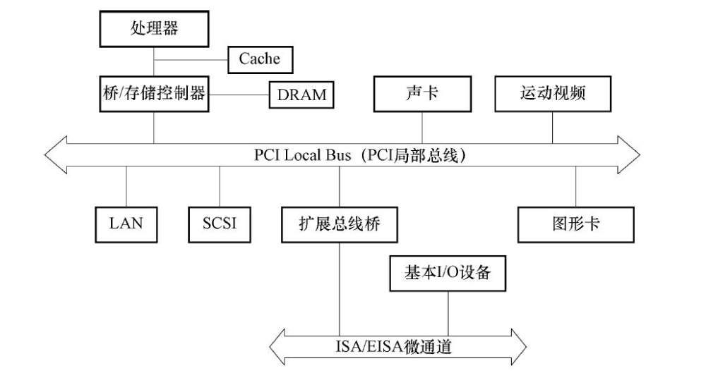
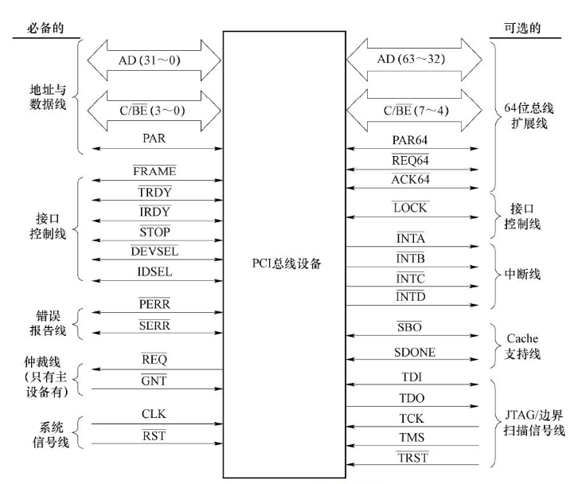
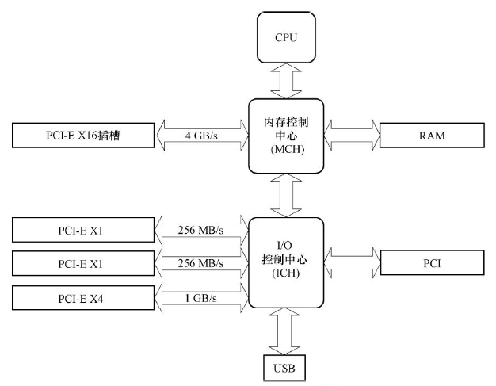
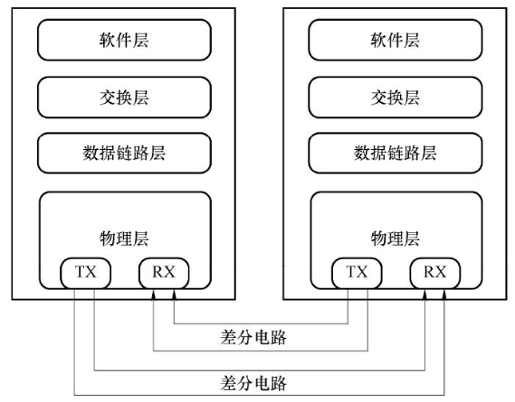

## PCI

- 32个物理部件×8个不同的功能部件

<table>
<tr>
<td colspan="1" align=center>

7-4 PCI总线体系结构

</td>
<td colspan="1" align=center>

7-5 PCI总线引脚定义

</td>
</tr>
</table>

## PCI-E

- 每个设备都有自己的专用连接，不需要向整个总线请求带宽。
- 数据传输率提高到一个很高的频率，达到PCI所不能提供的高带宽。

<table>
<tr>
<td colspan="1" align=center>

7-12 PCI-E总线在主板中的逻辑布局

</td>
<td colspan="1" align=center>

7-13 PCI-E的主要协议层

</td>
</tr>
</table>
