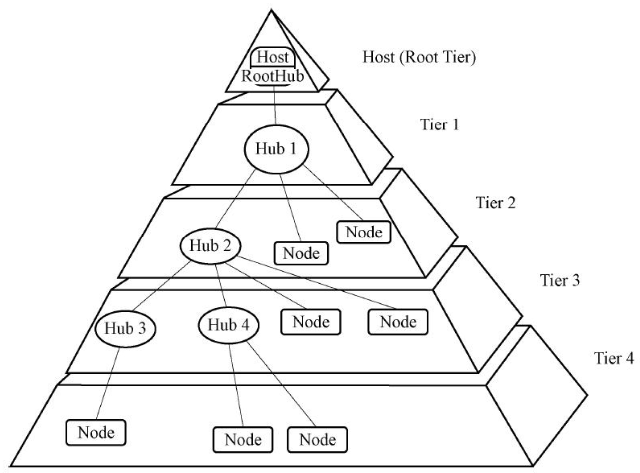

## USB总线

- 通用串行总线（Universal Serial Bus）
  - 支持热插拔且即插即用
  - USB总线的物理结构允许总线上挂接多个USB设备
  - 接口小、成本低
  - 性能可靠

```markdown
【2分】多选 下面哪些接口是采用串行差分的数据传输方式?
( )
选择一项或多项:
A. RS232
B.PATA
C.USB
D. SATA

答案：C、D
```



### USB规范

- USB1.1：速度较差，操作系统支持不够
- USB2.0：支持3种传输速率
- USB3.0：高带宽，高达5Gb/s，全双工

| 模式 | 速率/(Mb/s) | USB版本 |
| :--: | :---------: | :-----: |
| 低速 low-speed | 1.5 | 1.1 2.0 |
| 全速 full-speed | 12 | 1.1 2.0 |
| 高速 high-speed | 480 | 2.0 |

```markdown
【1分】以下关于USB2.0和USB3.0协议的描述错误的是
选择一项:
A. USB2.0为半双工,USB3.0为全双工
B. USB2.0采用非差分方式传输，USB3.0采用差分方式传输
C. USB3.0和USB2.0的电平标准一致，USB3.0的驱动能力更强
D. USB3.0接口兼容USB2.0接口

答案：B 
解析：两者都是差分传输
```

## I2C总线

I2C（Inter Integrated Circuit）

- **两线式串行总线**，SCL/SDA。
- 每个连接到总线的器件都可以通过唯一的地址和一直存在的简单的主机/从机关系软件**设定地址**。
- **多主机总线**。
- 串行的8位双向**数据传输位速率**在标准模式下可达100kb/s，快速模式下可达400kbt/s，高速模式下可达3.4Mb/s。
- **设备数量**受总线的最大电容400 pF限制。相同型号的器件，则还受器件地址位的限制。

```markdown
多选/中等/2 分】已知 USB 主机 D+/ D-引脚接 15K 欧下拉电阻，下列说法正确的是（ ）。
选择一项或多项：
A. 通过 D+连接小电阻使得引脚被上拉的为低速设备
B. 通过 D-连接小电阻使得引脚被上拉的为高速设备
C. 通过 D+连接小电阻使得引脚被上拉的为高速设备
D. 通过 D-连接小电阻使得引脚被上拉的为低速设备

答案：C、D
```
