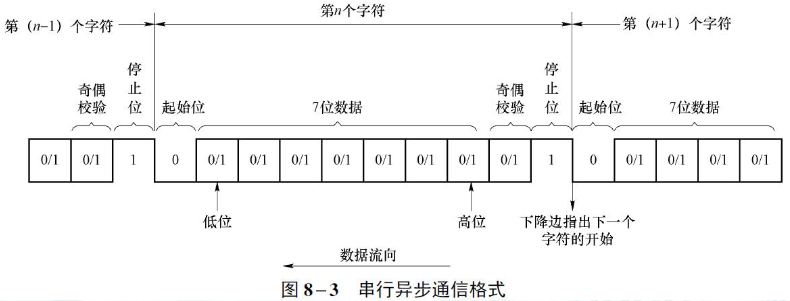
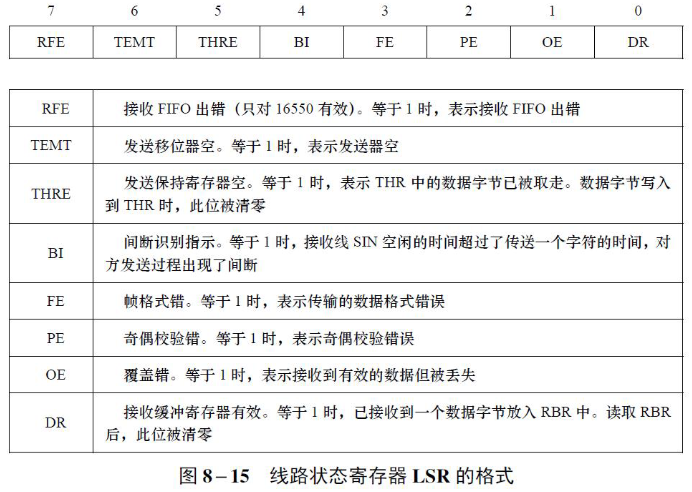
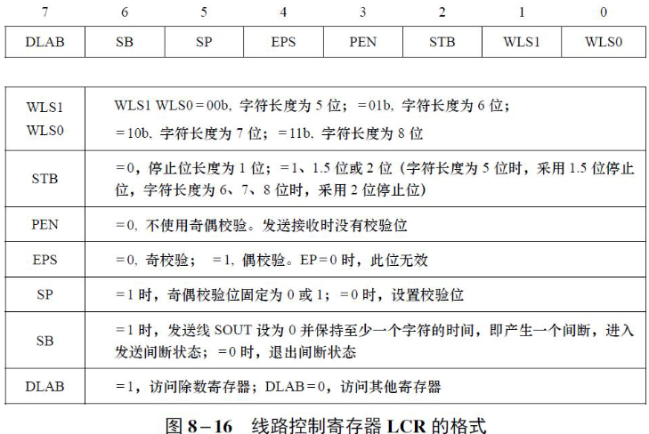
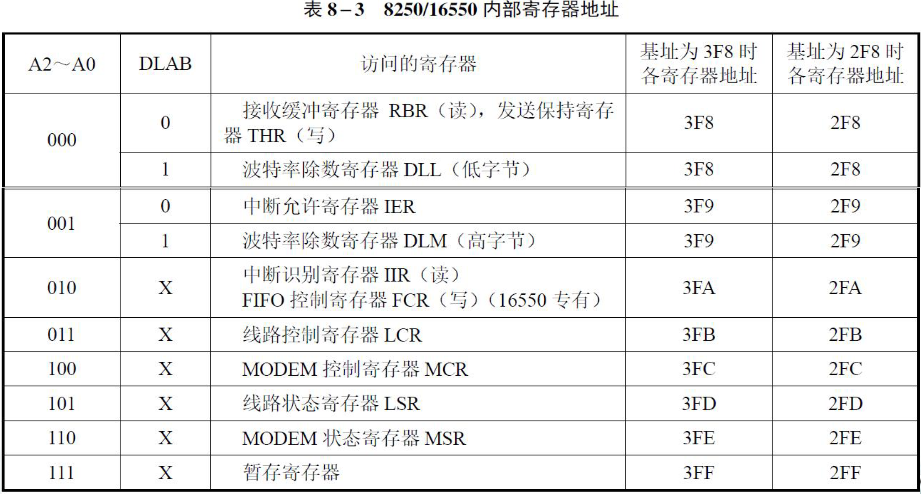

## 可编程串行通信


- f工作时钟 = f基准时钟 ÷ 除数锁存器 = 波特率 × 16 ；例8.7



<details>
<summary>例8.1 在异步串行通信中，其一帧数据格式为1位起始位，7位数据位，偶校验，1位停止位，则发送数据ASCII‘Q’的帧数据是什么？（起始位在左）</summary>

ASCII ‘Q’ = 51h（ <font color=red>1010001</font>），偶校验时校验位为 <font color=blue>1</font>。起始位为0，停止位为1，按照**低位先行**的规则，帧数据为0<font color=red>1000101</font><font color=blue>1</font>1。

</details>

### 波特率；数据传输效率；

<details>
<summary>例8.2 假定波特率为9600b/s，异步方式下，每个字符对应1个起始位、7 个数据位、1 个奇偶校验位和1 个停止位。

求：

- 每传输一个二进制位需要的时间是多少？
- 数据传输效率是多少？
- 每秒钟能传输的最大字符数为多少？
- 每秒钟有效数据传输位是多少？

</summary>

1. 每传输一个二进制位需要的时间是多少？

```math
1/9600 = 104.17us
```

2. 数据传输效率是多少？

```math
7 / (1 + 7 + 1 + 1) * 100% = 70%
```

3. 每秒钟能传输的最大字符数为多少？

```math
9600 / (1 + 7 + 1 + 1) = 960
```

4. 每秒钟有效数据传输位是多少？

```math
960 * 7 = 6720 bit
```

</details>


### 线路状态寄存器LSR,线路控制寄存器LCR

<!-- 例8.5，8.6 -->

<table>
<tr>
<td colspan="1" align=center>
<details>
<summary>线路状态寄存器LSR</summary>


</details>
</td>
<td colspan="1" align=center>
<details>
<summary>线路控制寄存器LCR</summary>


</details>
</td>
</tr>
</table>

### 寄存器地址

<details>
<summary>表8-3 8250/16550内部寄存器地址</summary>


</details>

<details>
<summary>例8.5 假定8250/16550基地址为3F8H（对应于A2、A1、A0 = 000B），那么发送保持寄存器、接收缓冲寄存器的地址为3F8H，而线路状态寄存器的地址为3FDH（A2、A1、A0 = 101B）。在不考虑串口发送、接收出错的情况下，试编写程序从串行接口发送和接收一个字符AL。</summary>

```asm
; 发送程序
SendByte PROC
    PUSH AX                 ; 要发送的数据压栈
    MOV DX, 3FDH            ; LSR端口号->DX
SendByteBusy:
    IN AL, DX               ; 读LSR端口状态->AL
    TEST AL, 20H            ; 检查LSR的THRE位
    JZ SendByteBusy         ; 如果THRE=0，说明发送缓冲器不空，继续等待
    POP AX                  ; 从栈中弹出要发送的数据
    MOV DX, 3F8H            ; THR端口号->DX
    OUT DX, AL              ; 发送数据
    RET
SendByte ENDP

; 接收程序
ReceiveByte PROC
    MOV DX, 3FDH            ; LSR端口号->DX
NoByteReceived:
    IN AL, DX               ; 读LSR端口状态->AL
    TEST AL, 01H            ; 检查LSR的DR位
    JZ NoByteReceived       ; 如果DR=0，说明接收缓冲器空，继续等待
    MOV DX, 3F8H            ; RBR端口号->DX
    IN AL, DX               ; 读接收数据
    RET
ReceiveByte ENDP
```

</details>


<details>
<summary>例8.6 8250地址范围为03F8H～03FFH，试编写程序设置发送字符长度为8位，2位停止位，偶校验。</summary>

解答：线路控制寄存器的地址为3FBH（A2、A1、A0 = 011B），控
制字应为00011111B。
参考程序段如下：

```asm
MOV DX, 3FBH ;LCR地址
MOV AL, 00011111B ;LCR的内容，数据格式参数
OUT DX, AL
```

</details>

### 波特率设置

8250/16550芯片传输数据的速率是由<font color=red>除数锁存器</font>控制的。计算机异步串行通信接口外接的<font color=red>1.8432MHz</font>基准时钟，通过除数寄存器给定的分频值，可以在8250内部产生不同的波特率，然后通过BAUDOUT引脚输出到RCLK，控制接收传输速率。对一个已知的波特率，按照以下公式计算除数锁存器的内容：

$$
f_{工作时钟} = \frac{f_{基准时钟}}{除数锁存器} = 波特率 \times 16
$$

这里$f_{基准时钟} = 1.8432MHz = 1843200Hz$，$f_{工作时钟}$是8250内部工作时钟频率，$波特率$是通信速率，单位为b/s。

$$
除数锁存器 = \frac{1843200}{波特率 \times 16} = \frac{115200}{波特率}
$$

除数锁存器

- 低字节（LSB）为DLL，高字节（MSB）为DLM。
- 写入DLM和DLL时，必须设置LCR中的DLAB为1

<details>
<summary>例8.7 编写程序，设置波特率为2400b/s</summary>

若选取波特率为2400，则除数锁存器=115200÷2400 =48=0030H。将00H写入DLM，30H写入DLL

```asm
MOV DX, 3FBH        ;LCR地址
MOV AL, 80H         ;LCR的内容，DLAB=1
OUT DX, AL          ;之后，3F8H、3F9H为DLL、DLM的地址
MOV DX, 3F8H        ;DLL地址
MOV AL, 30H         ;DLL内容
OUT DX, AL          ;写入DLL
MOV DX, 3F9H        ;DLM地址
MOV AL, 00H         ;DLM内容
OUT DX, AL          ;写入DLM
MOV DX, 3FBH        ;LCR地址
MOV AL, 00011111B   ;LCR的内容，数据格式参数，DLAB=0
OUT DX, AL          ;之后，3F8H为THR、RBR的地址，3FDH为IER的地址
```

</details>

<details>
<summary>例8.10 假定16550的端口地址为3F8～3FFH。16550以波特率为9600b/s进行串行通信，字符格式为7个数据位、2个停止位、奇校验方式，允许所有中断，试编写初始化程序。</summary>

解答：

- 波特率为9600b/s，则除数锁存器=115200÷9600 =12=0Ch。将00H写入DLM，0CH写入DLL。
- 字符格式为7个数据位、2个停止位、奇校验方式，允许所有中断，根据要求的数据帧格式，LCR的内容为00001110B=0EH。
- 查课本图8-17，可知IER的内容为00001111B=0FH，开放所有中断。
- FCR控制字为10010111B=87H，表示FIFO缓冲中有8个字节触发，发送和接收FIFO复位

```asm
; 置DLAB=1
MOV DX, 3FBH
MOV AL, 80H
OUT DX, AL
; 置除数锁存器
MOV DX, 3F8H
MOV AL, 0CH
OUT DX, AL
MOV DX, 3F9H
MOV AL, 00H
OUT DX, AL
; 置LCR
MOV DX, 3FBH
MOV AL, 0EH
OUT DX, AL
; 置Modem Control Register
MOV DX, 3FCH
MOV AL, 0BH
OUT DX, AL
; 置IER
MOV DX, 3F9H
MOV AL, 0FH
OUT DX, AL
; 置FCR
MOV DX, 3FAH
MOV AL, 87H
OUT DX, AL
```

</details>