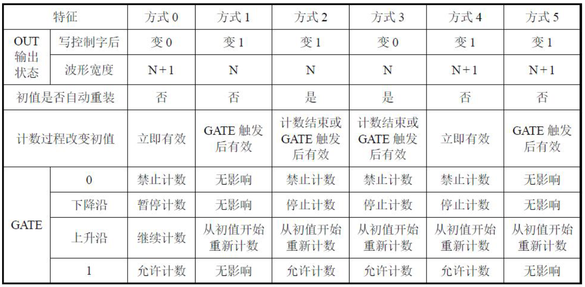

## 定时和计数及其应用

定时与计数

### 工作方式

- 方式1-可编程单稳态触发器
  - 由外部门控信号GATE上升沿触发，
    - <font color=red>产生一单拍负脉冲信号，脉冲</font>
  - 当写入方式1控制字后，OUT输出变为高电平。写入计数初值n之后，计数器并不立即开始计数，而要等到GATE上升沿后的下一个CLK输入脉冲的下降沿，OUT输出变低电平，计数才开始。计数到0时结束，OUT输出变高，
    - 从而<font color=red>产生一个宽度为n个CLK周期的负脉冲</font>
  - GATE信号的作用包括两个方面：
    - 计数结束后门控信号可重新触发计数；
    - 终止原来的计数过程，开始新的一轮计数
宽度由计数初值决定
- 方式2-脉冲波发生器
  - **N分频器**，输出是输入时钟按照计数值N分频后的一个连续脉冲。
  - 第一个时钟下降沿开始减1计数，减到1时，输出端OUT变为低电平，减到0时，输出OUT又变成高电平，同时从初值开始新的计数过程，即计数到1时，输出一个CLK脉冲宽度的负脉冲。
  - GATE一直维持高电平时，计数器输出$F_{OUT}=F_{CLK}÷n$固定频率的脉冲，为一个n分频器。
- 方式3-方波发生器
  - 方式3与方式2类似，所不同的是它们的OUT输出波形不同：方式2在计数过程结束前输出一个CLK时钟的负脉冲；而方式3输出一个方波。
  - 计数初值n为偶数时，方波的高电平和低电平的维持时间为 <font color=red>**n/2**</font> 个CLK时钟。
  - 计数初值n为奇数时，方波的高电平维持时间为 <font color=red>**(n+1)/2**</font> 个CLK时钟，低电平维持时间为 <font color=red>**(n-1)/2**</font> 个CLK 时钟
- 方式4-软件触发选通方式
  - 写入方式控制字后，OUT输出高电平。若GATE=1，写入初值后的下一个CLK脉冲开始减1计数，计数到达0值（不是减到1）后，OUT输出为低电平，<font color=red>持续一个CLK脉冲周期后再恢复到高电平</font>。输出负脉冲可以用作选通脉冲。
  - <font color=red>GATE为低电平时，禁止计数</font>，输出维持当时的电平。当GATE变高以后，允许计数。
  - 在计数过程中写入新的初值，在写入新值后的下一个时钟下降沿计数器将按新的初值计数，<font color=red>即新的初值立即生效</font>。
- 方式5-硬件触发选通方式
  - 写入计数初值后，计数器并不立即开始计数，而是由GATE门控脉冲的上升沿触发。
  - 计数结束（计数器减到0），输出一个持续时间为一个CLK时钟周期的负脉冲，然后输出恢复为高电平。
  - 输出负脉冲是<font color=red>通过硬件电路产生的门控信号上升沿触发得到的</font>，所以叫硬件触发选通方式。
  - 门控信号的上升沿到来后，会立即触发一个新的计数过程。
  - 新的计数初值需要门控信号上升沿触发后才有效。



```markdown
【1分】当需要用8254将某一高频信号转化为低频信号时，工作方式通常采用（ ）。
选择一项:

A.方式5-硬件触发选通方式
B.方式2-脉冲波发生器
C.方式1-可编程单稳态触发器
D.方式0-计数结束中断方式

答案：选B
```

- 软件定时
- 不可编程的硬件定时
- 可编程的定时
- 可编程定时器芯片8254
  - 数据总线缓冲器
  - 读写逻辑
  - 控制字寄存器
  - 计数器


<details>
<summary>例8.12 8254地址为40H～43H，编程将计数器0初始化为工作方式3，采用二进制计数模式，计数初值为2000。</summary>

解答：控制口的地址为43H，计数器初值为2000，即07D0H，两个字节，需要采用十六位计数，由上图可知，控制字的格式为00110110B=36H，所以程序为：

```assembly
MOV AL, 36H
OUT 43H, AL     ; 控制字写入控制口
MOV AL, 0D0H    ; 计数器初值低字节
OUT 40H, AL     ; 写入计数器0低字节
MOV AL, 07H     ; 计数器初值高字节
OUT 40H, AL     ; 写入计数器0高字节
```

如果采用BCD计数，2000的BCD为2000H那么程序为：

```assembly
MOV AL, 00110111B
OUT 43H, AL     ; 控制字写入控制口
MOV AL, 00H    ; 计数器初值低字节
OUT 40H, AL     ; 写入计数器0低字节
MOV AL, 20H     ; 计数器初值高字节
OUT 40H, AL     ; 写入计数器0高字节
```

</details>


<details>
<summary>例8.13 假定8254地址为40H～43H，编写程序锁存并读取计数器0的当前计数值。</summary>

控制字地址为43H，读写逻辑地址为40H，计数器0地址为40H，计数器1地址为41H，计数器2地址为42H，控制字为00000110B=06H，所以程序为：

```assembly
MOV AL, 06H
OUT 43H, AL     ; 控制字写入控制口
IN AL, 40H      ; 读取计数器0低字节
MOV AH, AL      ; 保存低字节
IN AL, 40H      ; 读取计数器0高字节
XCHG AL, AH     ; 交换高低字节
```

</details>

### 8254的应用

图8-36；图8-37对应的程序

<table>
<tr>
<td colspan="1">
<details>
<summary>图8-36 8254用于分频</summary>


**分频**：提供一个频率为10kHz的时钟信号，要求每隔100ms采集一次 数 据 。 对 于 一 个 1 0 k H z 时 钟 信 号 ， 其 周 期 为1/10kHz=0.0001s=0.1ms。需要对它进行分频，生成一个周期为100ms的信号，频率为10Hz。计数值1000。

对8253的初始化程序如下：

```assembly
MOV DX, 203H        ; 控制字端口地址
MOV AL, 00110100B   ; D7,D6=00B，选择计数器0；D5,D4=11B，十六位计数；D3~D1=010B，方式2；D0=0B，二进制计数
OUT DX, AL          ; 控制字写入控制字端口
MOV DX, 200H        ; 计数器0端口地址
MOV AL, 0E8H        ; 计数器0初值低字节 1000=03E8H
OUT DX, AL          ; 计数器0初值低字节写入计数器0端口
MOV AL, 03H         ; 计数器0初值高字节
OUT DX, AL          ; 计数器0初值高字节写入计数器0端口
```
</details>    
<td colspan="1">
<details>
<summary>图8-37 8254计数器的级联</summary>


**级联**：输入脉冲频率为10kHz，要产生周期为100s的定时信号（频率为0.01Hz），那么分频系数N为10k/0.01 =1000000。而计数器的最大计数范围为65536，通过一个计数器不能完成所要求的分频。此时可以将2个计数器进行级联。计数初值应该满足条件：N = N1×N2

这里N1=4000,N2=250，采用方式3，初始化程序如下：

```assembly
MOV DX, 203H        ; 控制字端口地址
MOV AL, 00110111B   ; D7,D6=00B，选择计数器0；D5,D4=11B，十六位计数；D3~D1=011B，方式3；D0=1B，BCD计数
OUT DX, AL          ; 控制字写入控制字端口
MOV AL, 01110111B   ; D7,D6=01B，选择计数器1；
OUT DX, AL          ; 控制字写入控制字端口
MOV DX, 200H        ; 计数器0端口地址
MOV AL, 00H         ; 计数器0初值低字节 4000的BCD为4000H
OUT DX, AL          ; 计数器0初值低字节写入计数器0端口
MOV AL, 40H         ; 计数器0初值高字节
OUT DX, AL          ; 计数器0初值高字节写入计数器0端口
MOV DX, 201H        ; 计数器1端口地址
MOV AL, 50H         ; 计数器1初值低字节 250的BCD为0250H
OUT DX, AL          ; 计数器1初值低字节写入计数器1端口
MOV AL, 02H         ; 计数器1初值高字节
OUT DX, AL          ; 计数器1初值高字节写入计数器1端口
```

</details>    
</td>
</td>
</table>