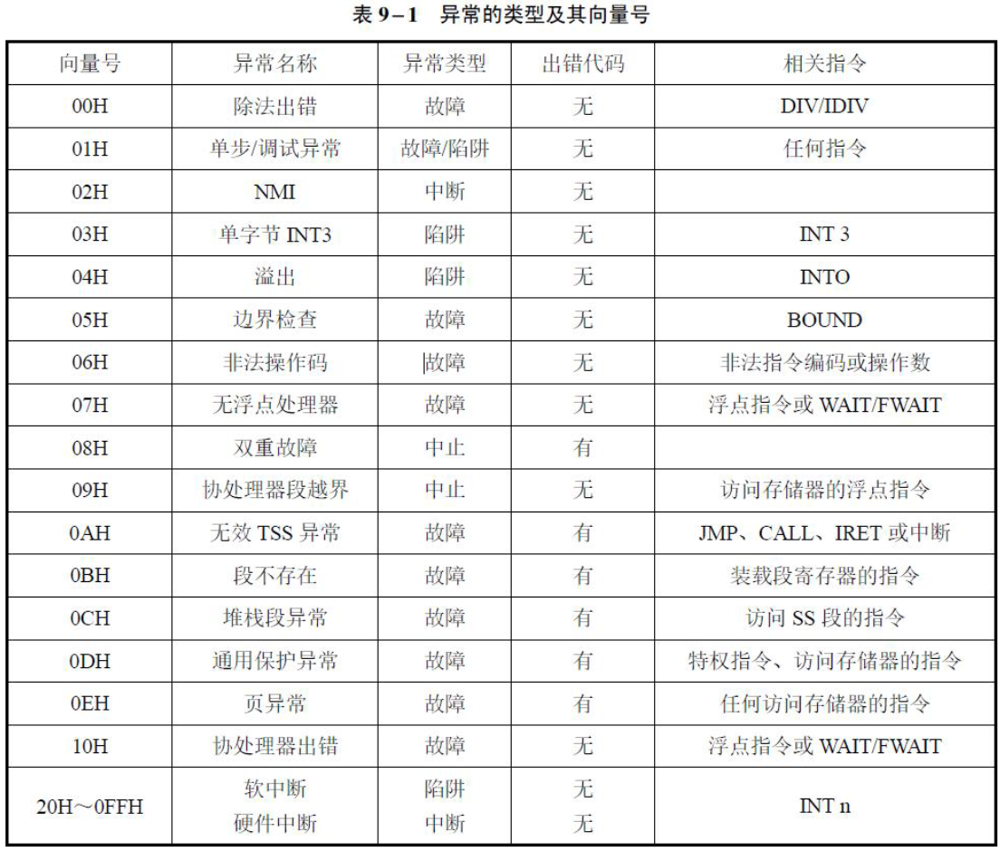

## 中断概述

### 中断、异常（故障、 陷阱、中止）

中断基本原理

- 使CPU中止正在执行的程序而转去处理特殊事件的操作。这些引起中断的事件称为中断源。
- Intel系列微处理器的对外的中断引脚包括两个申请中断的硬件引脚（INTR和NMI），一个响应INTR中断的硬件引脚（INTA）。除此之外微处理器还有软件中断INT，INTO，INT3和BOUND。
- 中断结构中的2个标志位IF（Interrupt Flag，中断标志）和TF（Trap Flag，陷阱标志）和一个特殊的返回指令IRET/IRETD。

中断分类

- CPU把中断分为内部中断和外部中断两大类。为了支持多任务和虚拟存储器等功能，保护模式下，把**外部中断**称为“中断”（Interrupt），把**内部中断**称为“异常”（Exception）。通常在两条指令之间响应中断或异常。CPU最多处理256种中断或异常。
- 中断可以分为可屏蔽中断和不可屏蔽中断。
  - INTR：标志寄存器EFLAGS 中的IF 标志决定是否响应INTR 的中断请求
  - NMI：不可屏蔽中断

### 补充

异常分类

- 故障：故障是在引起异常的指令之前，把异常情况通知给系统的一种情况。故障的特点是可排除。
- 陷阱：陷阱是在引起异常的指令执行之后触发的一种情况。软中断指令“INT n”、单步异常等。
- 终止：系统出现严重的不可恢复的事件时触发的一种异常，产生中止后，正执行的程序不能被恢复执行，系统要重新启动才能恢复正常运行状态。

