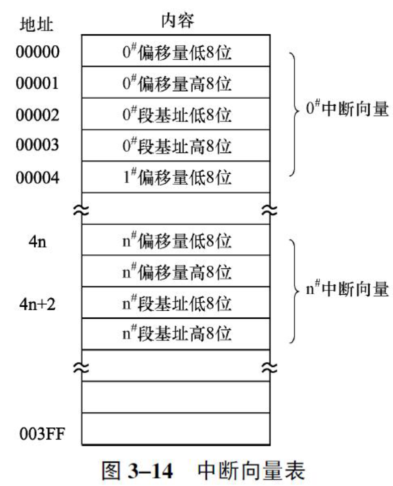

## 实模式的处理过程

- 中断向量表 
  - 可以参考[第三章程序控制指令](../03-指令系统/03-程序控制指令_star.md)和[中断描述符表寄存器IDTR](../02-微处理器管理模式/02-寄存器_star.md)来结合理解一下

<details><summary>中断向量表</summary> </details>

<details>
<summary>例9.2 实模式下中断向量表实例

```asm
0000:0000 68 10 A& 00 BB 13 73 05-16 00 98 03 B1 13 73 05
0000:0010 8B 01 70 00 B9 06 0E 02-40 07 0E 02 FF 03 0E 02
0000:0020 46 07 0E 02 0A 04 0E 02-3A 00 98 03 54 00 98 03
0000:0030 6E 00 98 03 88 00 98 03-A2 00 98 03 FF 03 0E 02
```

则第8号中断的中断处理程序的入口地址为：

```asm
INT 8H: 8*4=0020h 020E:0746
```

</summary>

</details>

