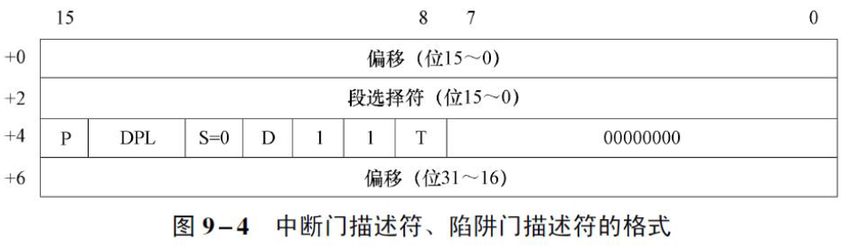
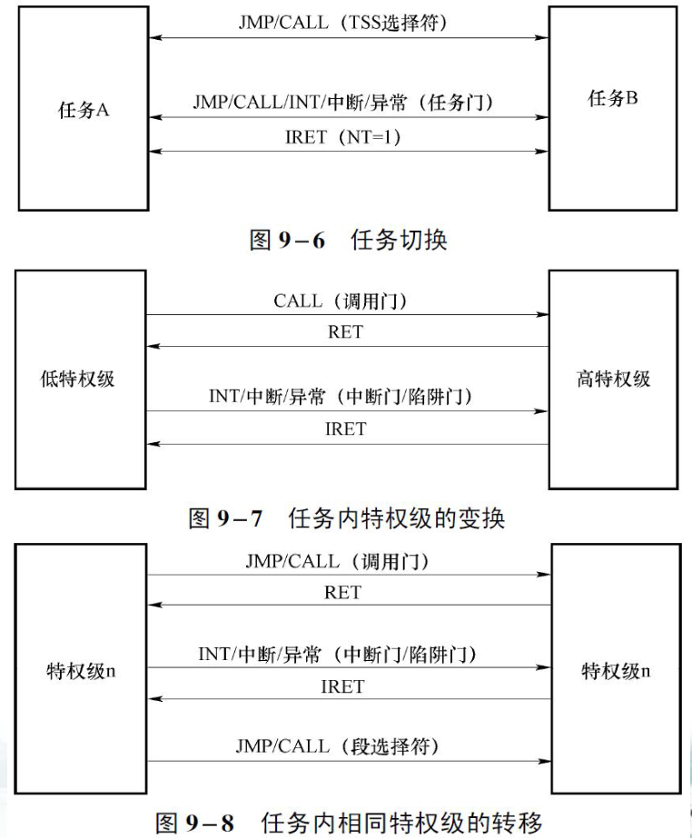

## 保护模式中断和异常的处理过程

中断描述符表

- 保护模式下响应中断或者处理异常时，CPU根据中断/异常向量号执行对应的处理程序，把中断类型号作为中断描述符表IDT中描述符的索引，取得一个描述符，从中得到中断/异常处理程序的入口地址。
- 每个CPU核具有唯一的一个IDT。IDT的位置不定，中断描述符表寄存器IDTR指示IDT在内存中的位置。

中断和异常响应步骤

- 如果是异常处理，首先根据异常类型确定返回地址（CS:EIP），对于故障，CS:EIP指向引起故障的指令；对于陷阱，CS:EIP指向引起陷阱的指令的下一条指令。
- 判断中断类型号要索引的门描述符是否超出IDT的界限。
- 再从IDT中取得对应的门描述符，分解出选择符、偏移量和属性字节，并进行有关检查。
- 根据门描述符类型，分别转入中断或异常处理程序。

跳转到中断服务程序的途径

- 通过中断门或者陷阱门的跳转
- 通过任务门的跳转
- 两种方式的比较

中断或异常处理后的返回

- 中断返回指令IRET用于从中断或异常处理程序中返回。该指令的执行根据任务嵌套标志NT位是否为1分为两种情形。由任务门转入中断或异常处理程序时，NT位被置1；由中断门或陷阱门转入中断或异常处理程序时，NT位被清0。
- NT位为1时，IRET执行的是嵌套任务的返回。
- NT位为0时，IRET执行的是当前任务内的返回。

任务切换

