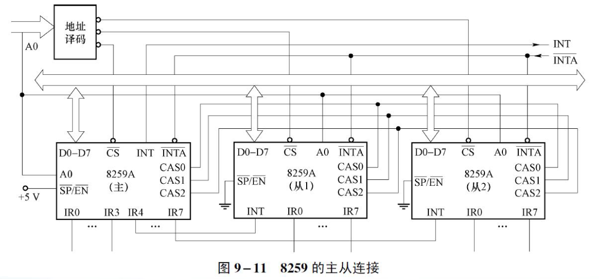

## 可编程控制器8259


```markdown
【多选/中等/2 分】已知某系统中有两片 8259 级联使用，主片使用特殊全嵌套，从片使用
普通全嵌套，则下列说法正确的是（ ）。
选择一项或多项：
A. 从片允许同级中断信号打断同级中断服务
B. 当主片级联从片的同一 IR 引脚有多次中断信号达到时，主片无法区分不同信号优先级高
低
C. 主片允许同级中断信号打断同级中断服务
D. 当从片的不同 IR 引脚有多次中断信号达到时，从片无法区分不同信号优先级高低

答案：B、C

主片无法区分优先级所以允许打断；从片可以区分优先级所以不允许打断
```

### 8259中断过程

- 当一条或多条中断请求线IR0～IR7变高时，设置相应的IRR位为1；
- 然后PR对中断优先权和中断屏蔽寄存器的状态进行判断，请求中断服务；
- CPU响应中断时，送出中断响应信号INTA，响应第一个INTA信号时，将当前中断服务寄存器中相应位置位，并把IRR中相应位复位。第二个INTA负脉冲期间，中断类型码被读入CPU。

### 8259工作流程

- IR2出现中断请求，该引脚的对应的中断屏蔽字相应位为0，即没有被屏蔽。此时由于ISR全为0，没有比它的优先级更高的中断正在执行，IR2的请求被送往CPU。
- CPU响应中断时，8259将ISR的值变为00000100B，标志IR2正在被服务。
- 假定IR7出现中断请求。由于IR2比IR7优先级更高，此请求暂时被忽略。
- 假定IR1出现中断请求。由于IR1比IR2优先级更高，此请求被送往CPU。
- CPU响应中断时，8259将ISR的值变为00000110B，标志IR2被中断，IR1正在被服务。

<details>
<summary>8259的初始化过程</summary>


</details>

### 8259的级联

- 只有当系统中有多片8259级联时（ICW1的SNGL位等于0）才需要设置ICW3；2片8259级联，`=8*1+7=15`个中断；3片8259能够支持的最大中断源数目为8×2+6=22 最多可以支持 `8*8+0=64`
- CAS2～CAS0：级联信号。由多片8259构成的主从结构中，只有一个主片，一个或多个从片，从片最多有8个。主片和从片的CAS2～CAS0全部对应相连，在中断响应时主片发送从片的标识码（0~7）。在第2个INTA#脉冲期间，只有标识码匹配的从片才把中断类型码送至数据总线。



- 从上图可以看出，在级联情况下，当 CPU 响应从片中断请求时，主片8259通过CAS输出被响应的从片编号，并且所有从片都能接收到

### 初始化命令字ICW1-4

<details>
<summary>例9.6 某系统使用单片8259，中断请求信号为上升沿触发，需要设置ICW4，该片8259的端口地址为20H和21H，则ICW1应为多少？</summary>

<table>
<tr>
<td colspan="1" align=center>


</td>
<td colspan="1">

解答：初始化命令字ICW1的为：`00010011B=13H`

设置ICW1的指令为：

```asm
MOV AL,13H
OUT 20H,AL
```

</td>
</tr>
</table>
</details>

<details>
<summary>例9.7 假设系统中使用单片8259，该片8259的端口地址为20H和21H ， 8个中断源的中断类型码为08H～0FH（00001000B～00001111B），则应如何初始化ICW2？</summary>

<table>
<tr>
<td colspan="1" align=center>


</td>
<td colspan="1">

解答：初始化命令字ICW2的为：`00001000B=08H`

设置ICW2的指令为：

```asm
MOV AL,08H
OUT 21H,AL
```

</td>
</tr>
</table>
</details>

```markdown
若某外设的中断类型号是 06EH，则应连接 8259 的引脚编号及 ICW2 的
值为（ ）。
选择一项：
a. IR6,0DH
b. IR7,6EH
c. IR7,67H
d. IR6,68H

答案 D

高五位为命令字68H，低三位为引脚编号类型号110B=IR6
```

<details>
<summary>例9.8 系统中，使用两片8259，主片8259的端口地址为20H和21H，从片8259的端口地址为0A0H和0A1H，从片8259的INT连接到主片的IR2上，则应如何初始化ICW3？</summary>

<table>
<tr>
<td colspan="1" align=center>


</td>
<td colspan="1">

解答：主片的IR2接从片，则主片ICW3为00000100B=04H，从片的ICW3为00000010B=02H.

主片、从片应分别进行初始化：

```asm
MOV AL,04H
OUT 21H,AL
MOV AL,02H
OUT 0A1H,AL
```

</td>
</tr>
</table>
</details>

```markdown
当 8259 工作在（ ）方式时，需要 ICW3 命令字。
选择一项：
A. 选通
B. 查询
C. 单片
D. 级联

答案：D
```

<details>
<summary>例9.9 假定包含两片8259。主片地址为20H和21H，从片的地址为A0H和A1H；两片都工作在<b>特殊嵌套</b>方式、<b>非缓冲</b>模式，采用<b>非自动</b>中断结束。写出主片和从片的ICW4初始化程序。</summary>

<table>
<tr>
<td colspan="1" align=center>


</td>
<td colspan="1">

解答：主片和从片的ICW4均为00010001B=11H

```asm
MOV AL,11H
OUT 21H,AL
OUT 0A1H,AL
```

</td>
</tr>
</table>
</details>

```markdown
当 8259 的 ICW4 内容是 13H 时，（ ）阶段会把 ISR 寄存器中对应的位清
零。
选择一项：
A. 第二个 INTA 信号到来时
B. 写出 OCW2 之后
C. 第一个 INTA 信号到来时
D. 发出 EOI 命令后

答案：A
```

### 中断屏蔽操作命令字OCW1-3

<details>
<summary>例9.10 8259的端口地址为20H和21H，试编写程序屏蔽IR2、IR5两个中断源。</summary>

<table>
<tr>
<td colspan="1" align=center>


</td>
<td colspan="1">

解答：屏蔽IR2、IR5两个中断源，即屏蔽中断源2、5，OCW1的值为：`00100100B=24H`

```asm
MOV AL,24H
OUT 21H,AL
```

</td>
</tr>
</table>
</details>

<details>
<summary>例9.11 8259地址为20H和21H，编写程序完成如下操作：

1. 清除IR2对应的ISR
2. 设置IR4为最高优先级

</summary>

<table>
<tr>
<td colspan="2" align=center>


</td>
<td colspan="1">

解答：

1. 清除IR2对应的ISR，应该向偶地址即20H，写入OCW2控制字，OCW2的值为：`01100010B=62H`

```asm
MOV AL,62H
OUT 20H,AL
```

2. 设置IRi为最高优先级，只需要采用循环优先级，设置前一个IRi-1为最低优先级即可。因此指定IR3为最低优先级，OCW2的值为：`11000011B=0C3H`，那么此时优先级由高到低为：IR4、IR5、IR6、IR7、IR0、IR1、IR2、IR3。

```asm
MOV AL,0C3H
OUT 20H,AL
```

</td>
</tr>
</table>
</details>

<details>
<summary>例9.12 编写程序段读取8259中IRR和ISR的值。</summary>

<table>
<tr>
<td colspan="1" align=center>


</td>
<td colspan="1">

解答：

OCW3=00001010B=0AH，或00001011B=0BH写入偶地址20H，然后对8259进行读操作A0=0，可以获得IRR和ISR的值。

```asm
MOV AL,0BH  ; 读ISR
OUT 20H,AL
IN AL,20H
MOV AL,0AH  ; 读IRR
OUT 20H,AL
IN AL,20H
```

8259初始化完毕后，中断屏蔽寄存器IMR自动定位为A0=1的地址。此时不必事先写入OCW3，直接读取A0=1的端口即可获得中断屏蔽码。（A0=0，则从20H读；A0=1，则从21H读）

读取IMR中断屏蔽字

```asm
IN AL,21H
```

</td>
</tr>
</table>
</details>


