## 题型

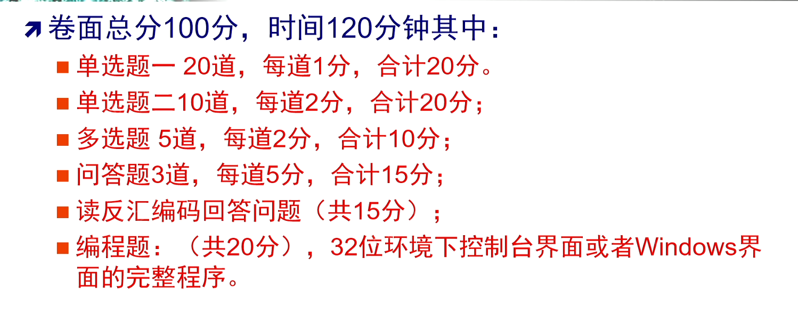

## 单项选择题

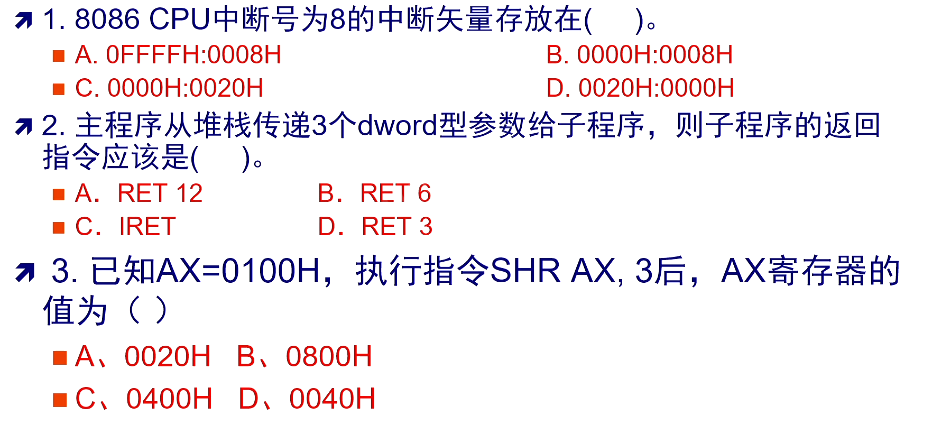

> 1. C 不懂，第九章中断向量表的内容
> 2. A
> 3. A

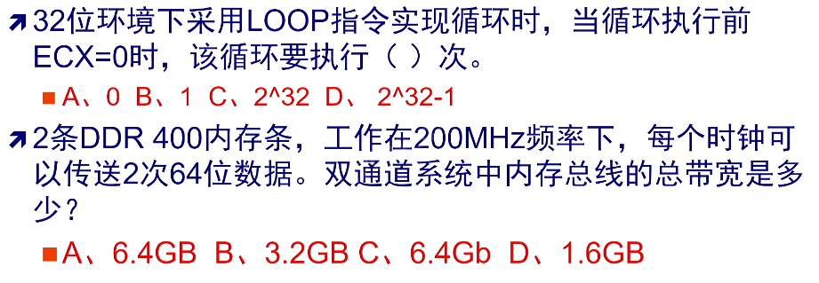

> 1.  C 先减1，再计数 课本P106
> 2.  A P205 64x200x2x2/8 = 6400 = 6.4GB/s

## 复杂单项选择题

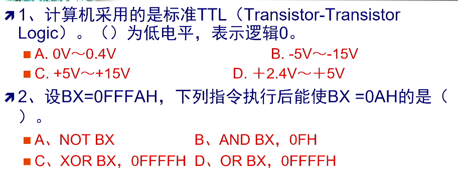

> 1. A 第八章接口技术
> 2. B

## 多项选择题

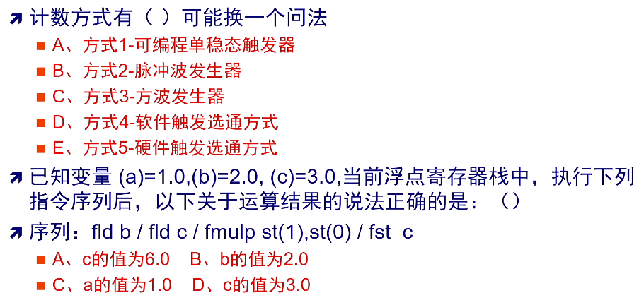

> 1. P315
>
> 2. ABC P155
>    1. fld float load (push)
>    2. fmulp float mul pop
>    3. fst float store
>    4. st stack st[0]表示栈顶

## 问答题

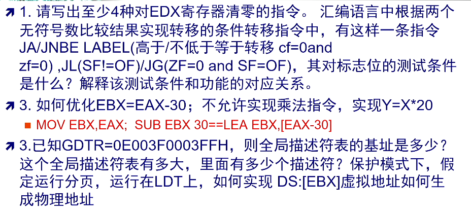

> 1. P96
>
>    1. 测试条件 ->要去多看课本 P104测试条件
>
> 2.  P163
>
>    ```assembly
>    1. 
>    lea ebx,[eax-30]
>    
>    2.
>    mov eax, X
>    lea eax,[eax+eax*4]
>    shl eax,2
>    mov Y, eax
>    ```
>
> 3. P48 2.6
>
>    1. GDTR = `GDTbase(4bytes) + Limit(2bytes)` P41

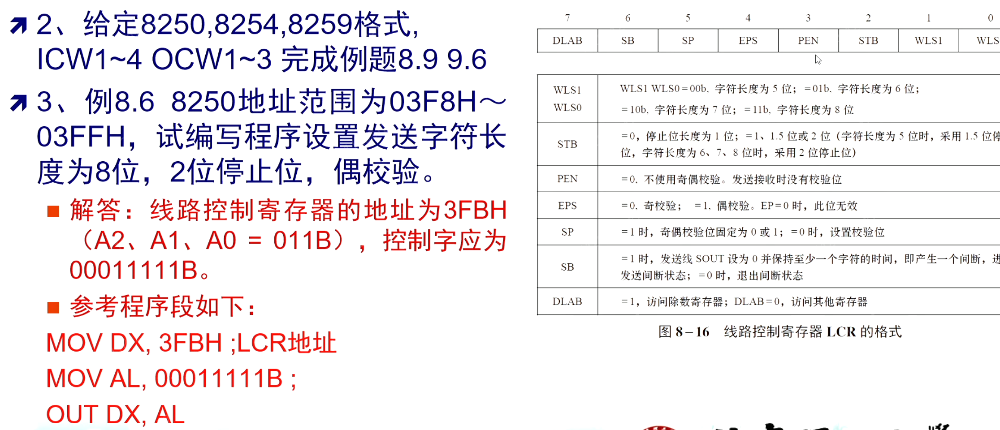

> 看表说话

反汇编题程序题 P191

## 串讲复习

> 标红要特别注意

### 第一章

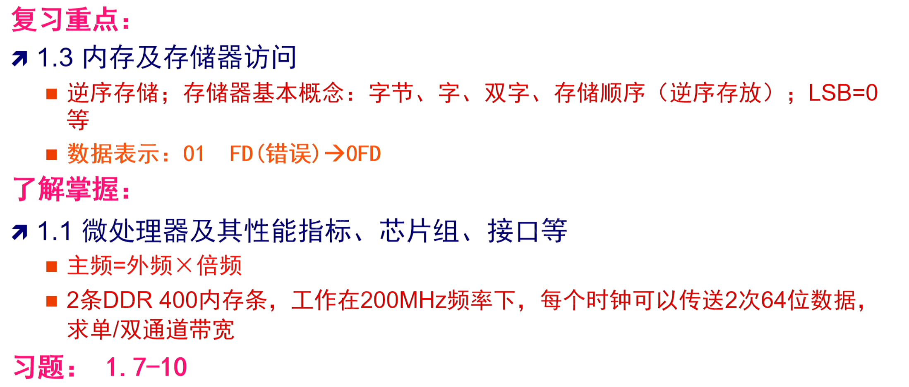

### 第二章

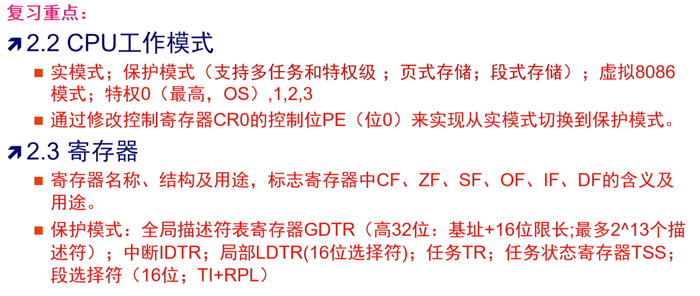

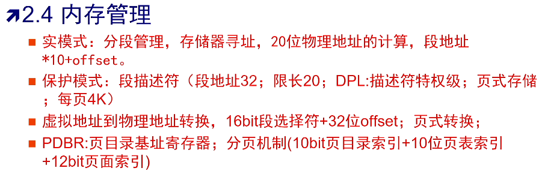

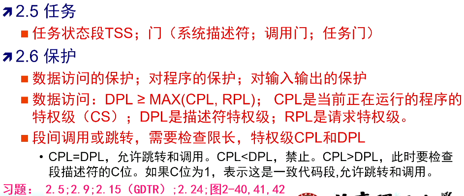

P67

### 第三章

P76 77

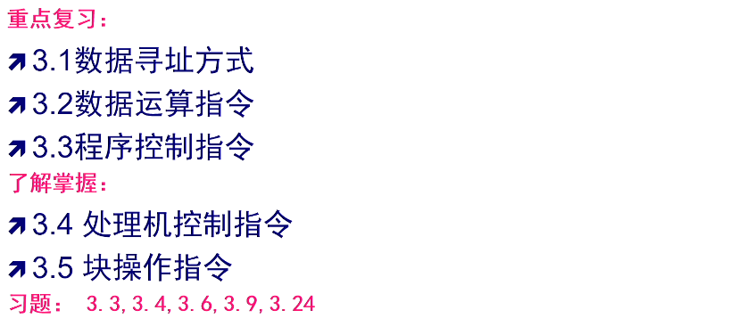

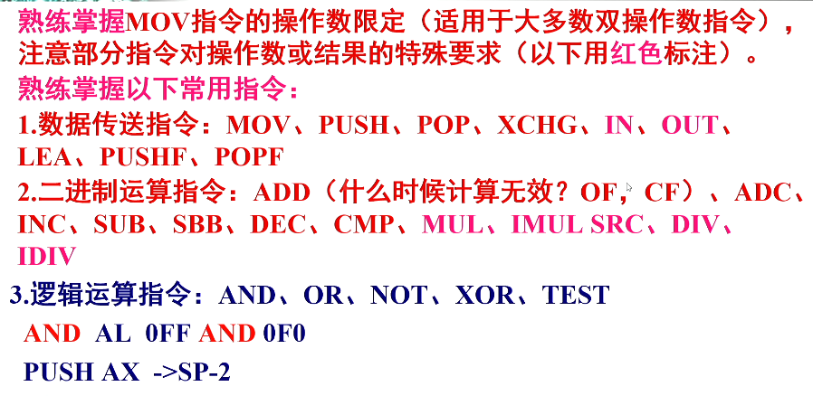

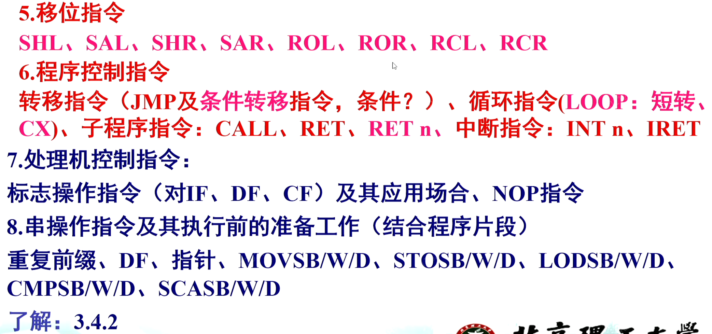

- P95 测试对标志位的影响

### 第四章

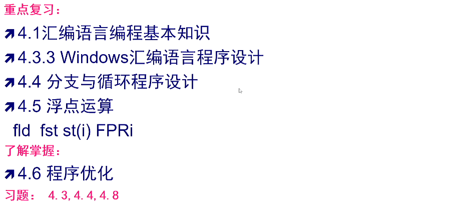

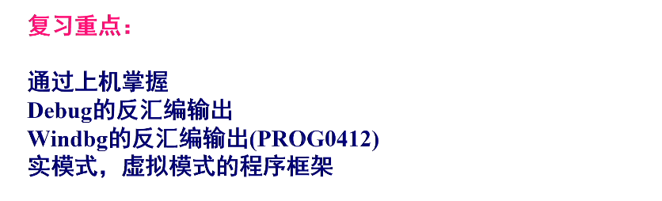

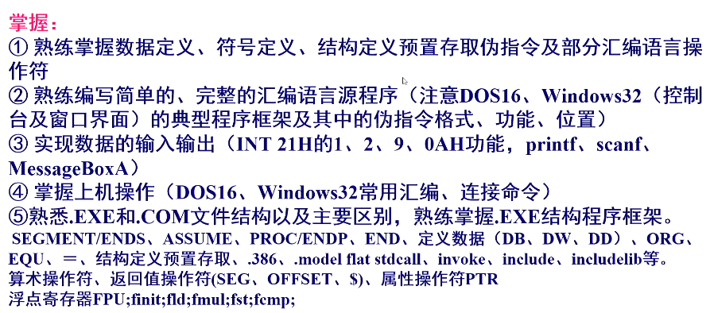

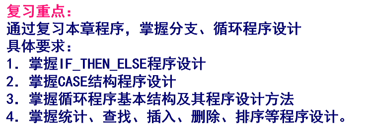

P129程序框架要自己写出来

### 第五章

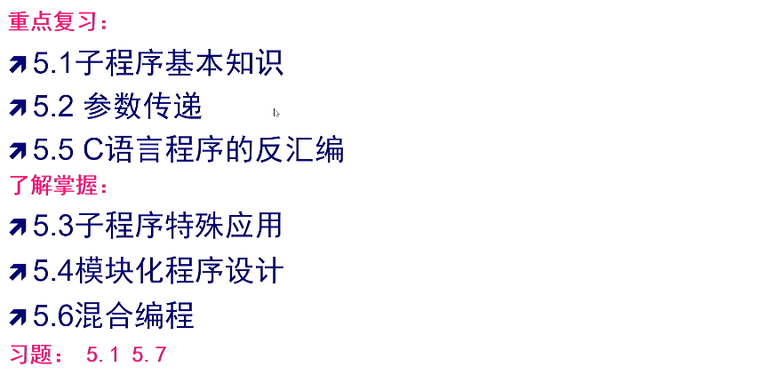


### 第六章

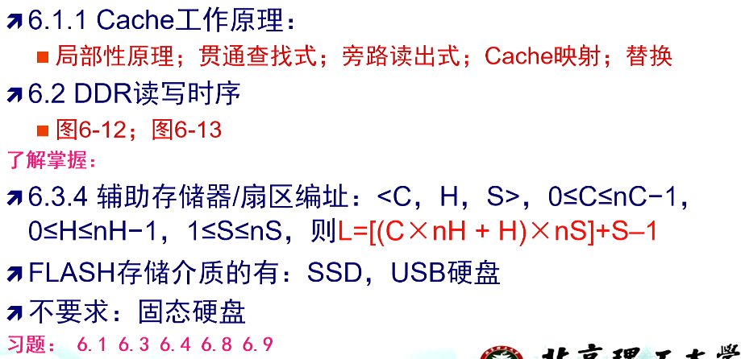


### 第七章

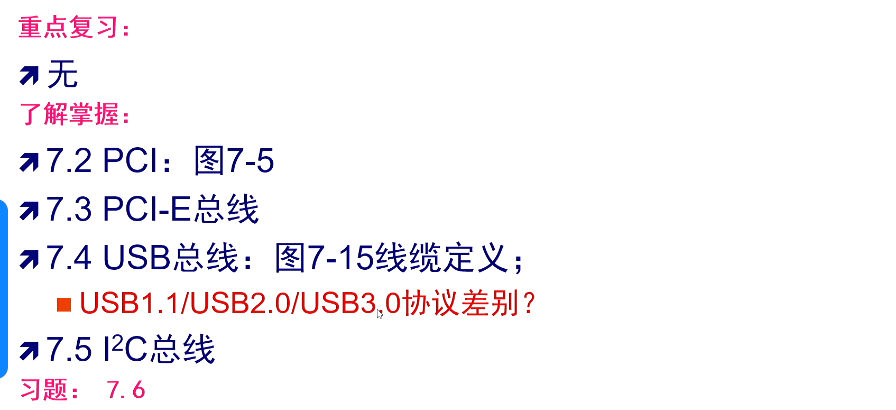


### 第八章

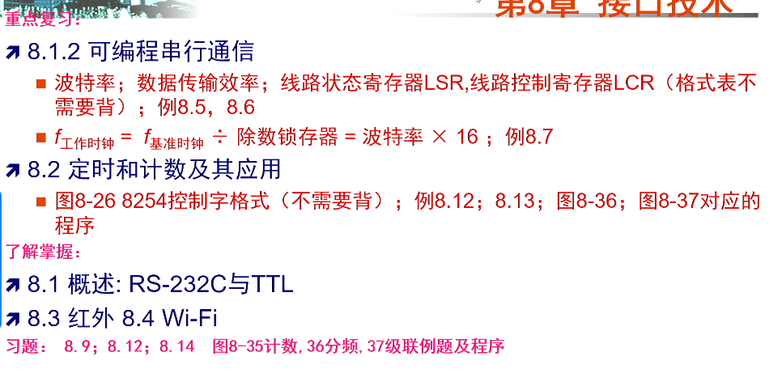

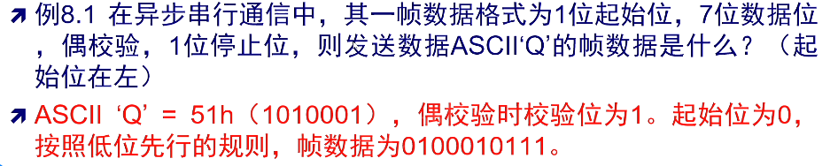


### 第九章

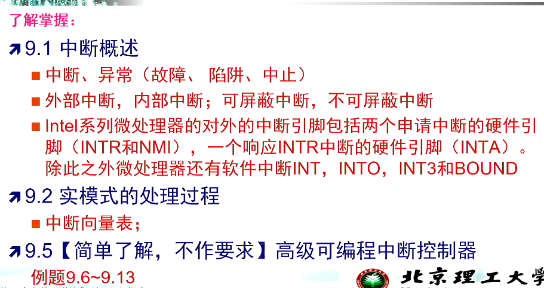

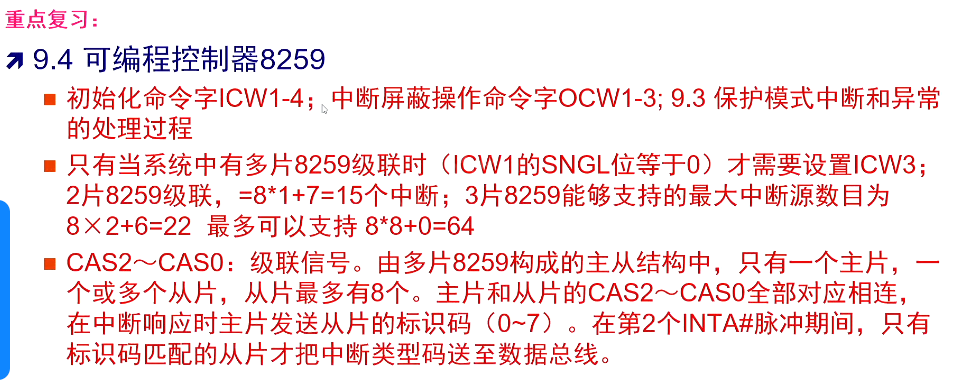

- 主片 从片计算